# Summary of 3_Linear

[<< Go back](../README.md)

## Logistic Regression (Linear)
- **n_jobs**: -1
- **explain_level**: 2

## Validation
 - **validation_type**: split
 - **train_ratio**: 0.8
 - **shuffle**: True
 - **stratify**: True

## Optimized metric
logloss

## Training time

3.9 seconds

## Metric details
|           |    score |     threshold |
|:----------|---------:|--------------:|
| logloss   | 0.345621 | nan           |
| auc       | 0.906904 | nan           |
| f1        | 0.904382 |   0.464752    |
| accuracy  | 0.864407 |   0.464752    |
| precision | 0.980519 |   0.959688    |
| recall    | 1        |   0.000507832 |
| mcc       | 0.682364 |   0.464752    |

## Metric details with threshold from accuracy metric
|           |    score |   threshold |
|:----------|---------:|------------:|
| logloss   | 0.345621 |  nan        |
| auc       | 0.906904 |  nan        |
| f1        | 0.904382 |    0.464752 |
| accuracy  | 0.864407 |    0.464752 |
| precision | 0.863118 |    0.464752 |
| recall    | 0.949791 |    0.464752 |
| mcc       | 0.682364 |    0.464752 |

## Confusion matrix (at threshold=0.464752)
|              |   Predicted as 0 |   Predicted as 1 |
|:-------------|-----------------:|-----------------:|
| Labeled as 0 |              158 |               72 |
| Labeled as 1 |               24 |              454 |

## Learning curves
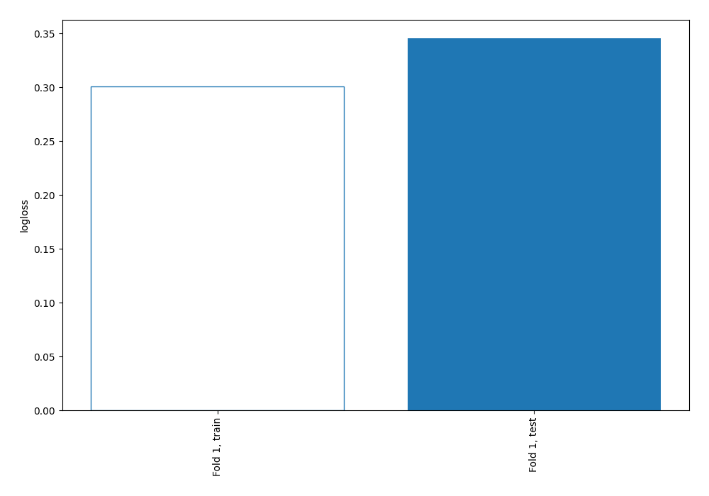

## Coefficients
| feature                                        |   Learner_1 |
|:-----------------------------------------------|------------:|
| Curricular units 2nd sem (approved)            |  1.91506    |
| Curricular units 1st sem (approved)            |  1.03281    |
| International                                  |  0.989073   |
| intercept                                      |  0.957405   |
| Tuition fees up to date                        |  0.854316   |
| Scholarship holder                             |  0.601766   |
| Curricular units 1st sem (enrolled)            |  0.418369   |
| Curricular units 2nd sem (grade)               |  0.347788   |
| Mother's occupation                            |  0.279664   |
| Curricular units 1st sem (without evaluations) |  0.24119    |
| Previous qualification                         |  0.130939   |
| Curricular units 2nd sem (evaluations)         |  0.129417   |
| Curricular units 2nd sem (without evaluations) |  0.0869332  |
| Marital status                                 |  0.07521    |
| Father's qualification                         |  0.0614747  |
| Admission grade                                |  0.0407838  |
| Father's occupation                            | -0.00129375 |
| Curricular units 1st sem (evaluations)         | -0.00519497 |
| Application mode                               | -0.0124005  |
| GDP                                            | -0.0143274  |
| Previous qualification (grade)                 | -0.0264753  |
| Inflation rate                                 | -0.0311511  |
| Daytime/evening attendance                     | -0.0616525  |
| Application order                              | -0.0781885  |
| Nacionality                                    | -0.110889   |
| Displaced                                      | -0.112898   |
| Unemployment rate                              | -0.182637   |
| Mother's qualification                         | -0.194609   |
| Course                                         | -0.217954   |
| Gender                                         | -0.252324   |
| Age at enrollment                              | -0.28335    |
| Educational special needs                      | -0.30324    |
| Curricular units 1st sem (grade)               | -0.337954   |
| Debtor                                         | -0.366157   |
| Curricular units 1st sem (credited)            | -0.37494    |
| Curricular units 2nd sem (credited)            | -0.529974   |
| Curricular units 2nd sem (enrolled)            | -1.39113    |

## Permutation-based Importance
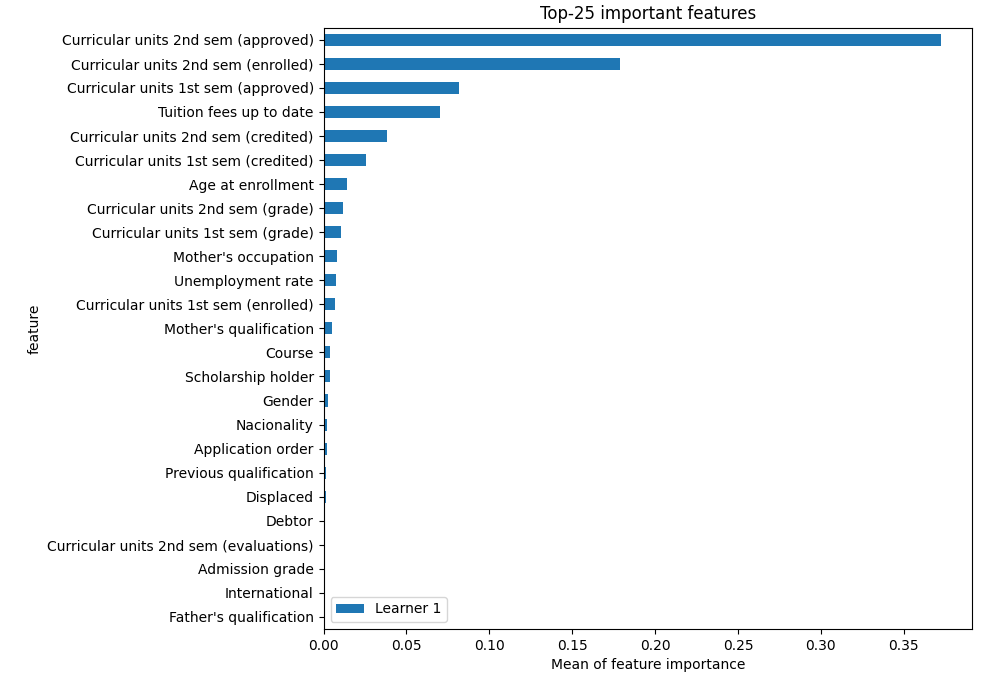
## Confusion Matrix

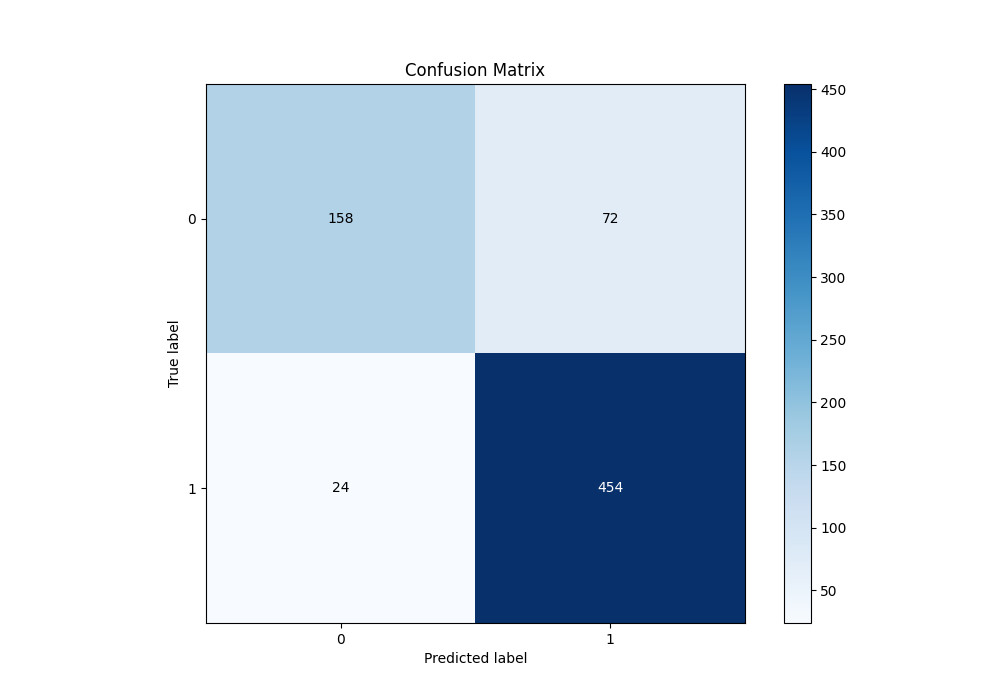

## Normalized Confusion Matrix

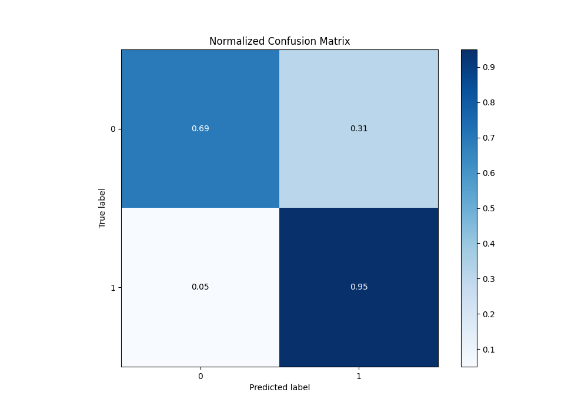

## ROC Curve

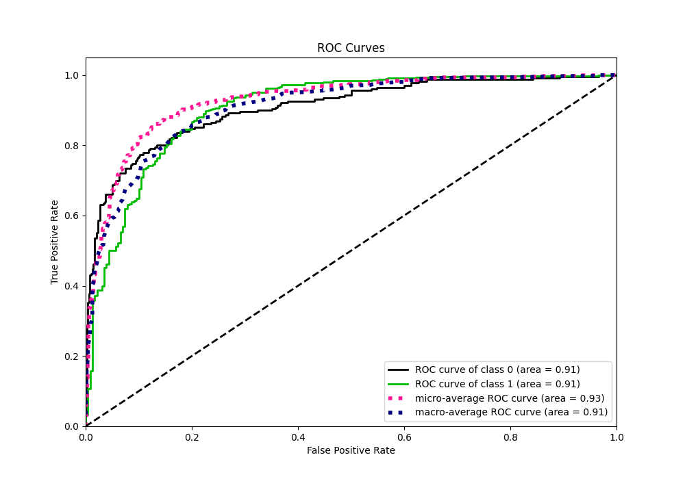

## Kolmogorov-Smirnov Statistic

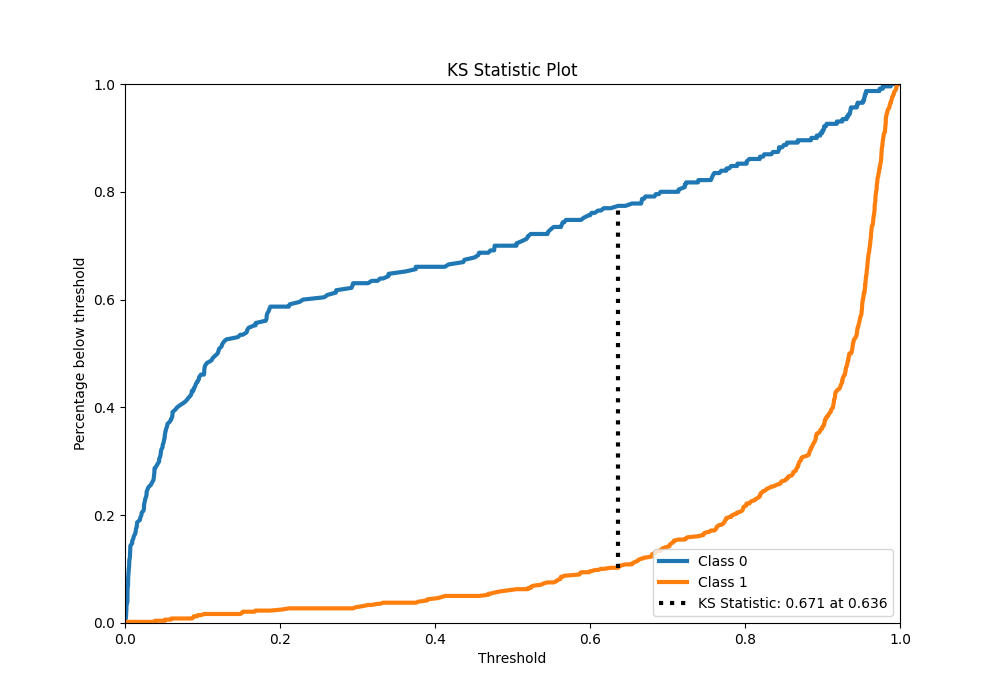

## Precision-Recall Curve

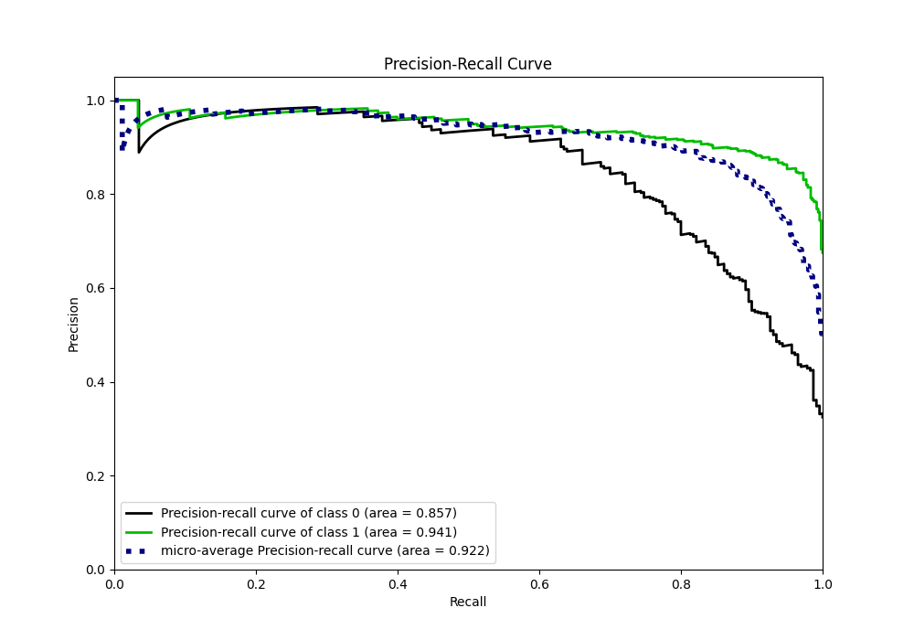

## Calibration Curve

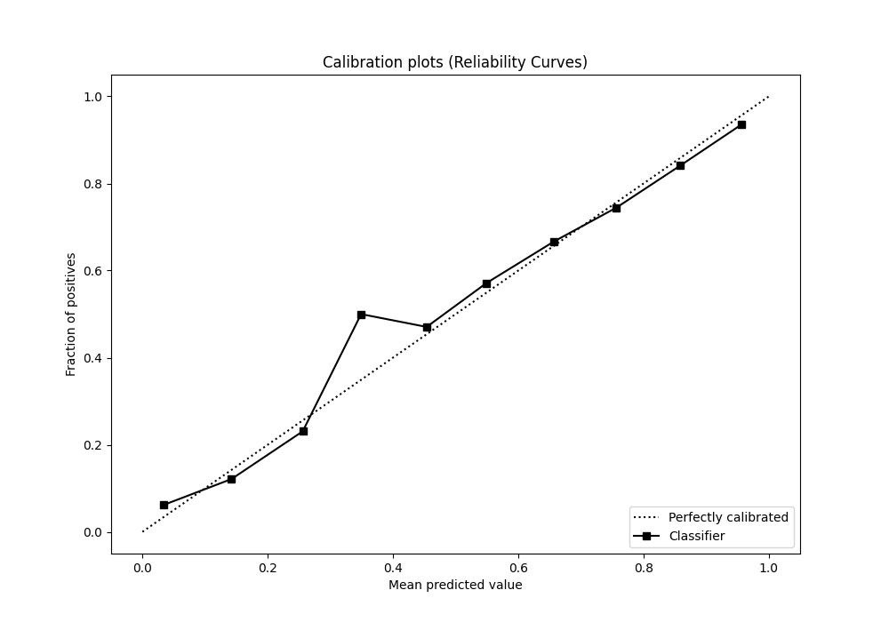

## Cumulative Gains Curve

## Lift Curve

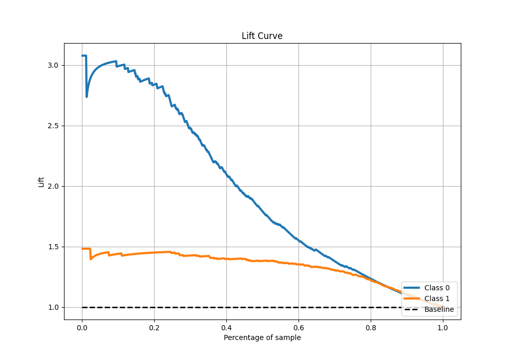

## SHAP Importance
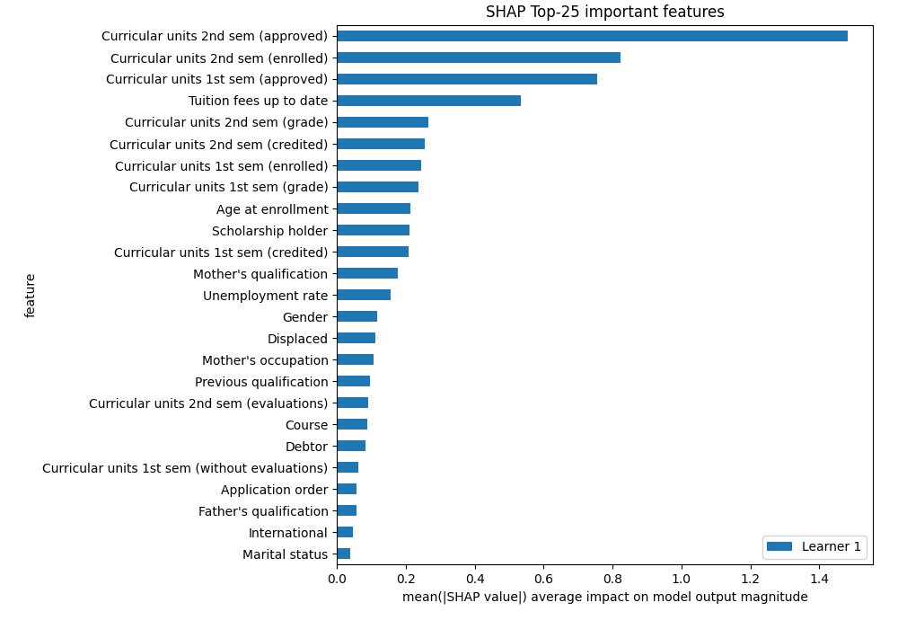

## SHAP Dependence plots

### Dependence (Fold 1)
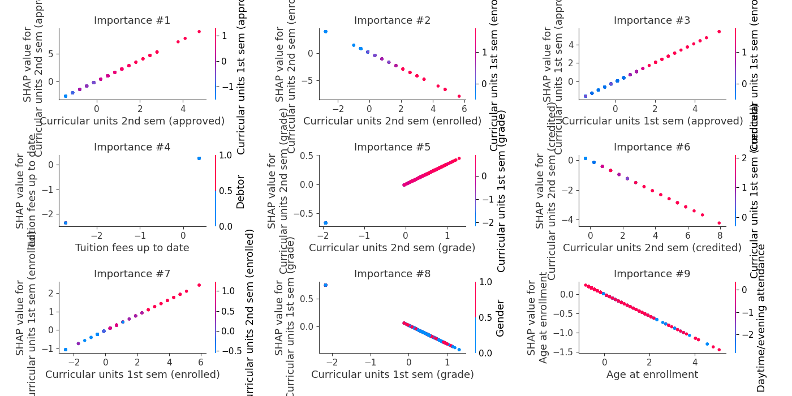

## SHAP Decision plots

### Top-10 Worst decisions for class 0 (Fold 1)
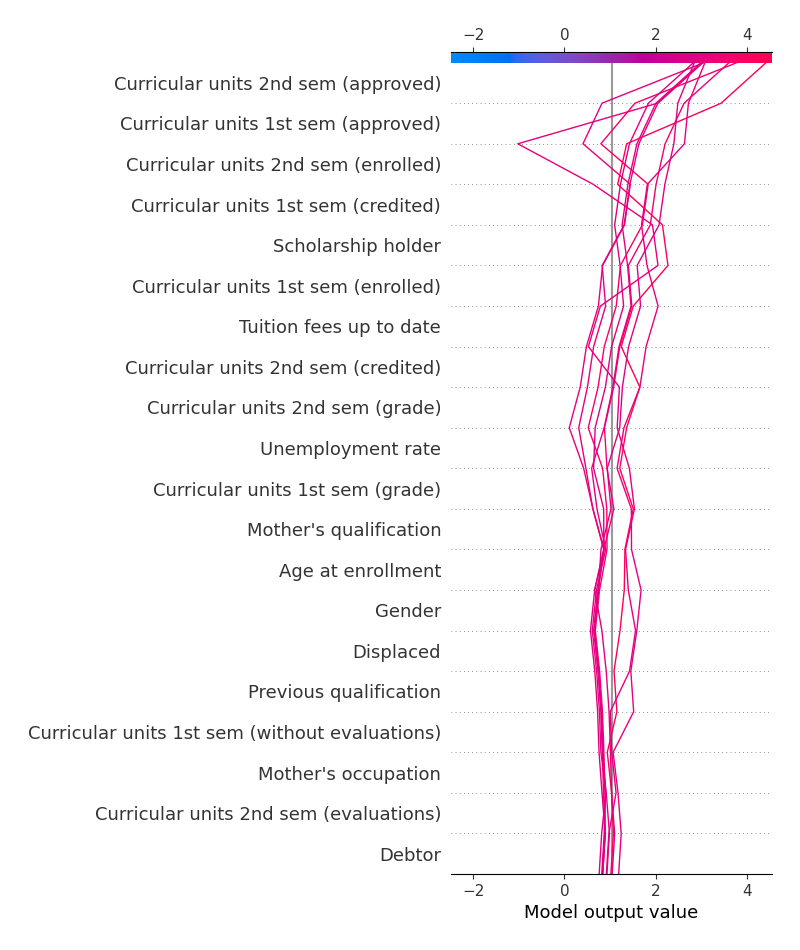
### Top-10 Best decisions for class 0 (Fold 1)
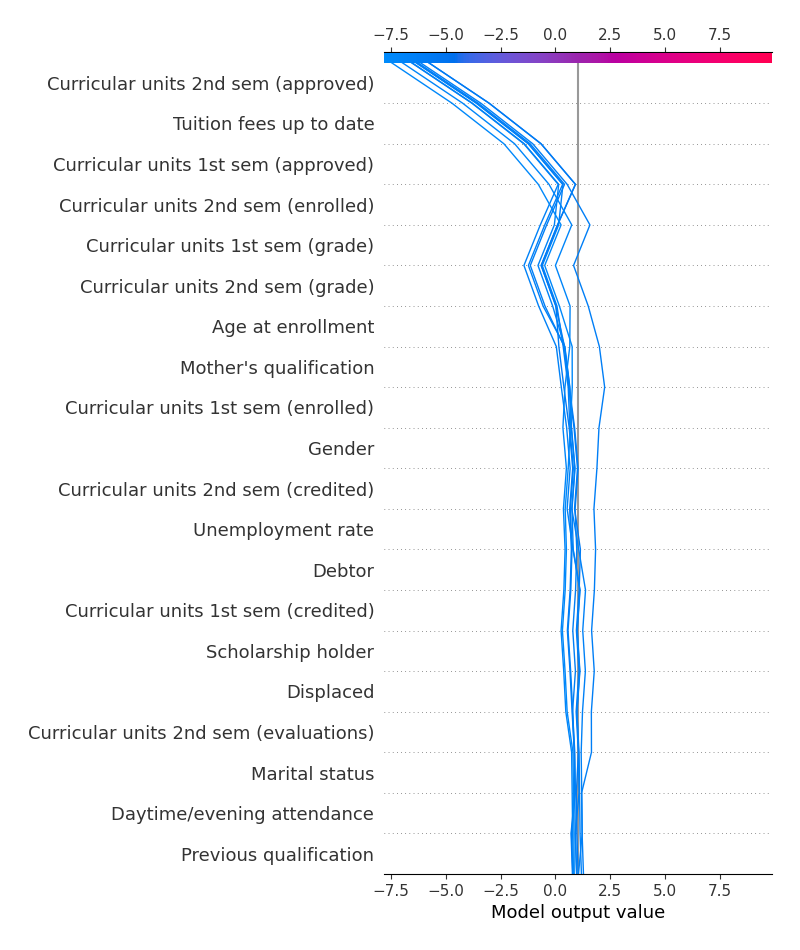
### Top-10 Worst decisions for class 1 (Fold 1)
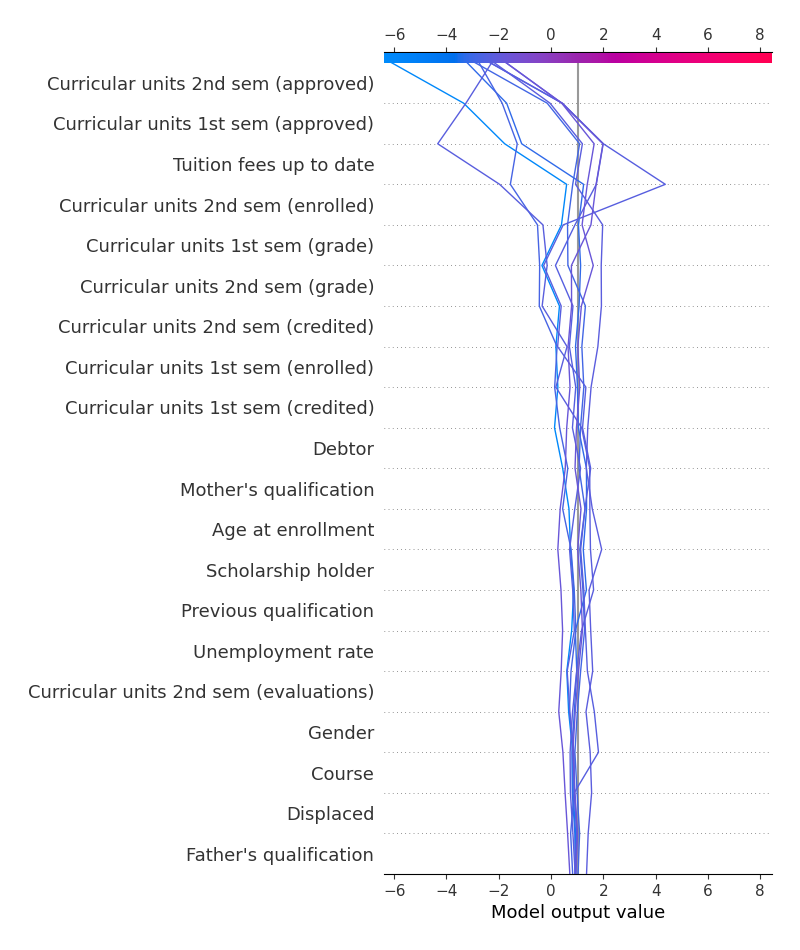
### Top-10 Best decisions for class 1 (Fold 1)
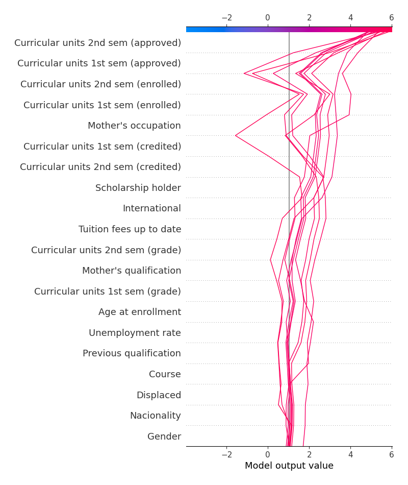

[<< Go back](../README.md)
