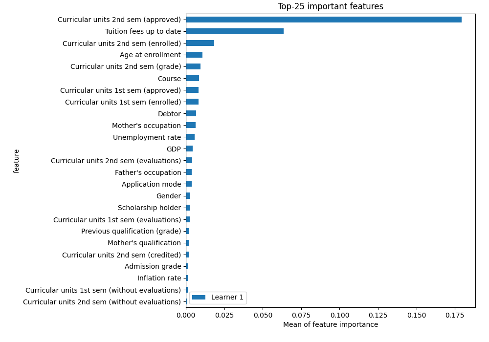
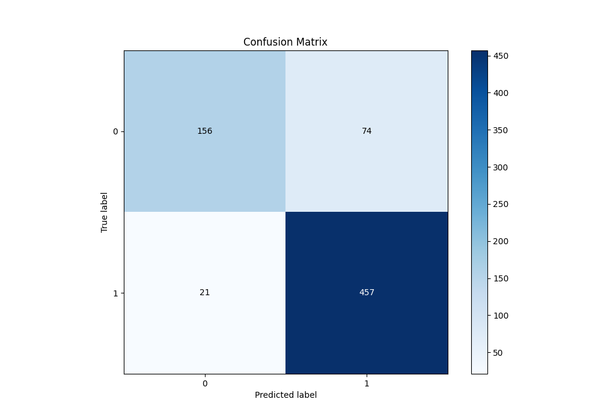
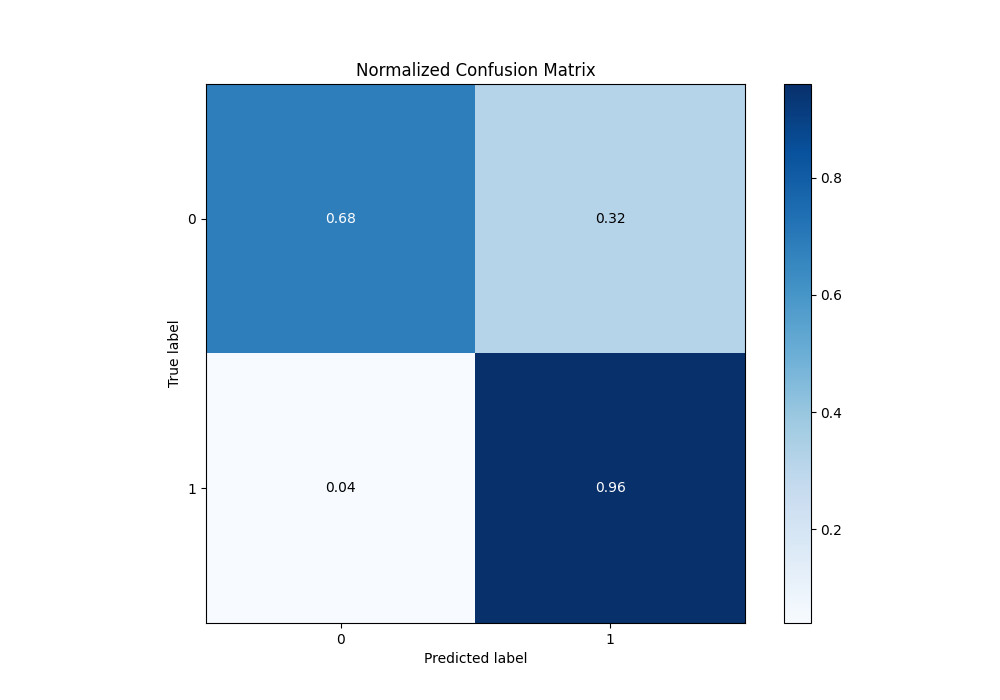
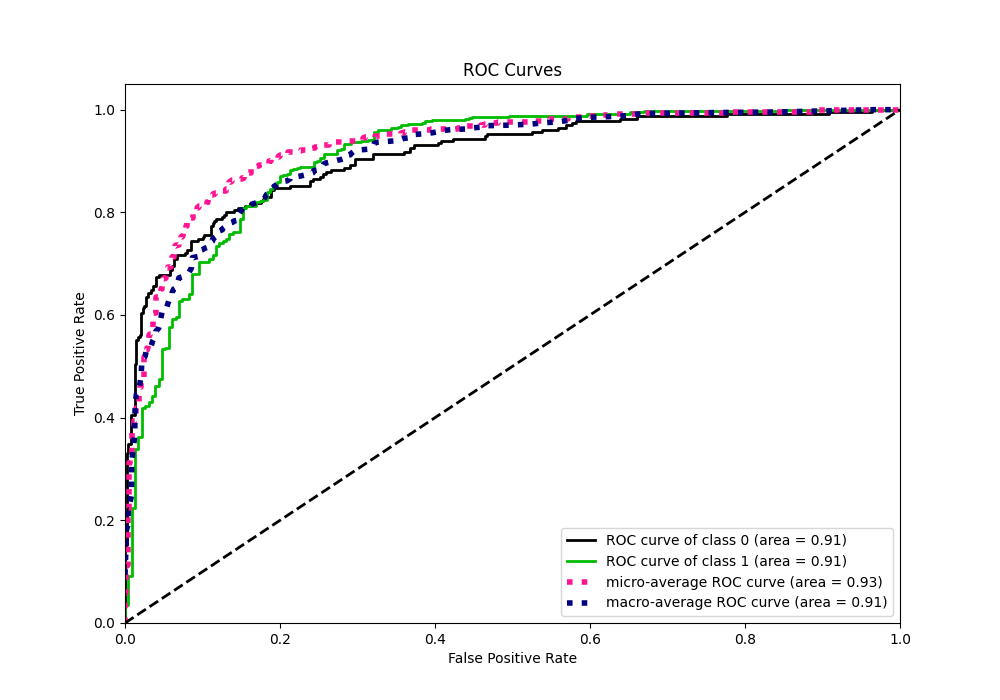
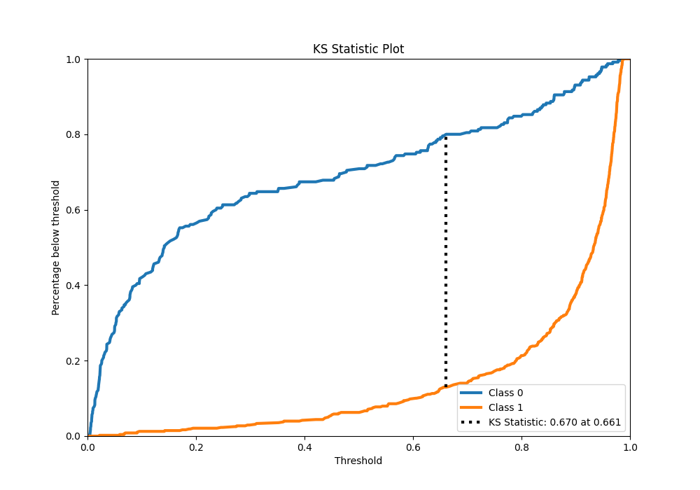
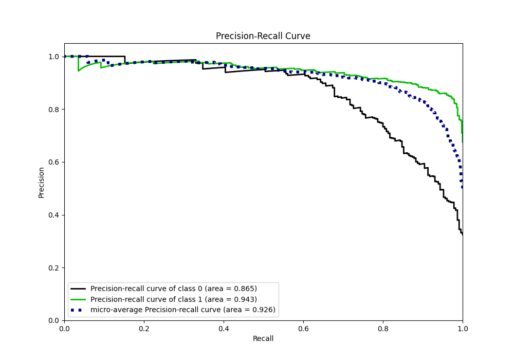
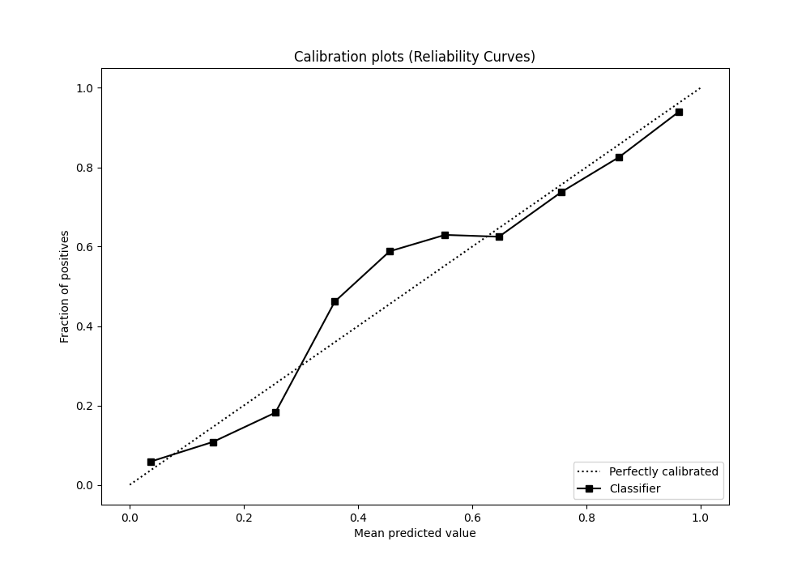
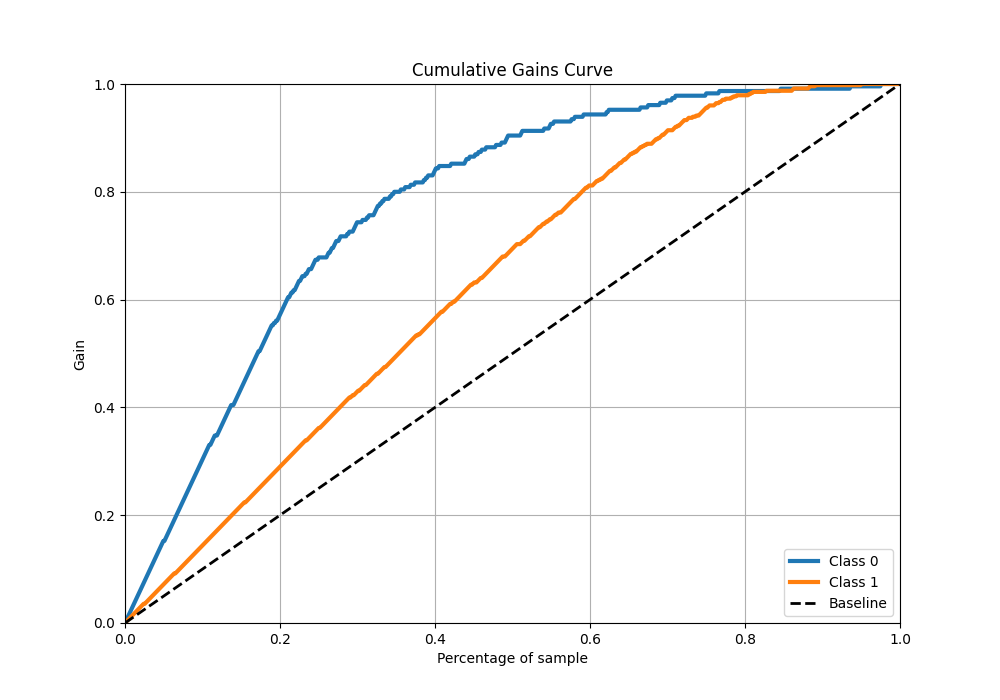
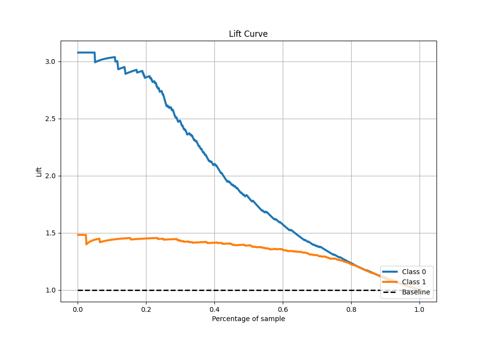

# Summary of 6_Default_CatBoost

[<< Go back](../README.md)

## CatBoost
- **n_jobs**: -1
- **learning_rate**: 0.1
- **depth**: 6
- **rsm**: 1
- **loss_function**: Logloss
- **eval_metric**: Logloss
- **explain_level**: 2

## Validation
 - **validation_type**: split
 - **train_ratio**: 0.8
 - **shuffle**: True
 - **stratify**: True

## Optimized metric
logloss

## Training time

2.4 seconds

## Metric details
|           |    score |   threshold |
|:----------|---------:|------------:|
| logloss   | 0.338587 | nan         |
| auc       | 0.909241 | nan         |
| f1        | 0.905847 |   0.434591  |
| accuracy  | 0.865819 |   0.434591  |
| precision | 1        |   0.983825  |
| recall    | 1        |   0.0040206 |
| mcc       | 0.686053 |   0.434591  |

## Metric details with threshold from accuracy metric
|           |    score |   threshold |
|:----------|---------:|------------:|
| logloss   | 0.338587 |  nan        |
| auc       | 0.909241 |  nan        |
| f1        | 0.905847 |    0.434591 |
| accuracy  | 0.865819 |    0.434591 |
| precision | 0.86064  |    0.434591 |
| recall    | 0.956067 |    0.434591 |
| mcc       | 0.686053 |    0.434591 |

## Confusion matrix (at threshold=0.434591)
|              |   Predicted as 0 |   Predicted as 1 |
|:-------------|-----------------:|-----------------:|
| Labeled as 0 |              156 |               74 |
| Labeled as 1 |               21 |              457 |

## Learning curves

## Permutation-based Importance

## Confusion Matrix

## Normalized Confusion Matrix

## ROC Curve

## Kolmogorov-Smirnov Statistic

## Precision-Recall Curve

## Calibration Curve

## Cumulative Gains Curve

## Lift Curve

[<< Go back](../README.md)
