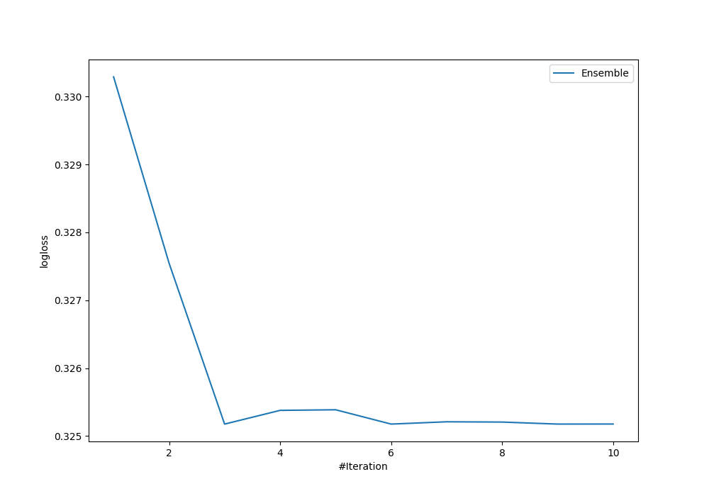
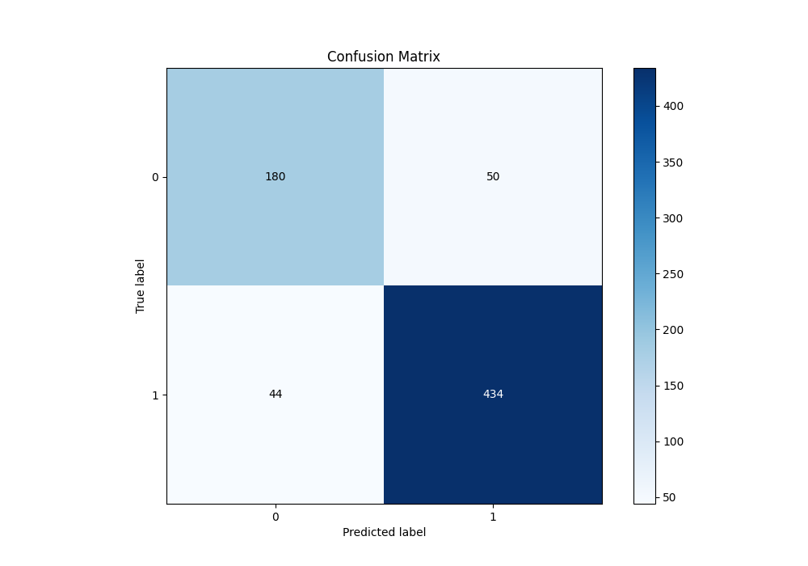
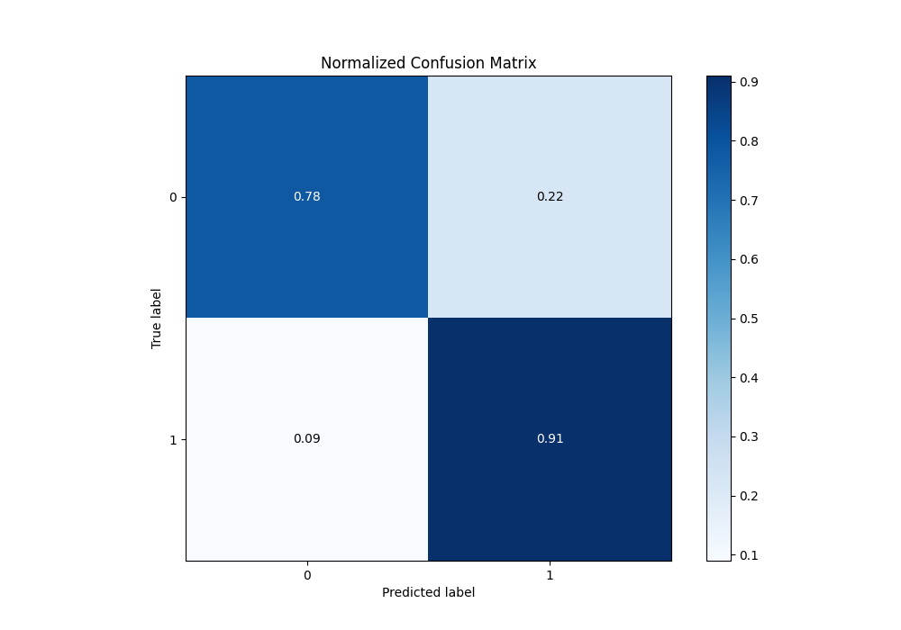
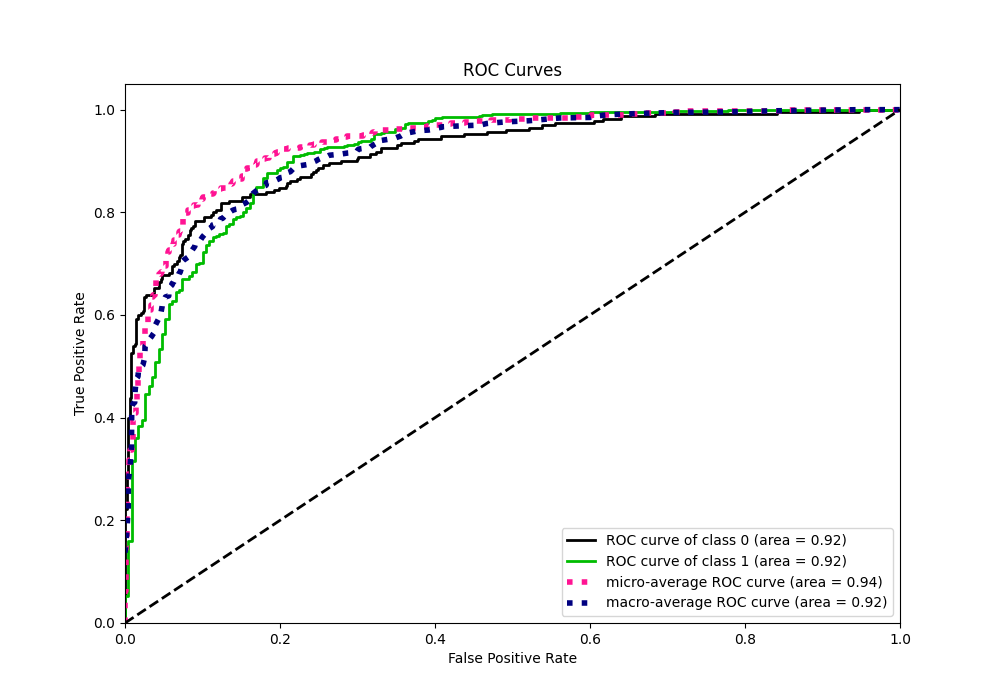
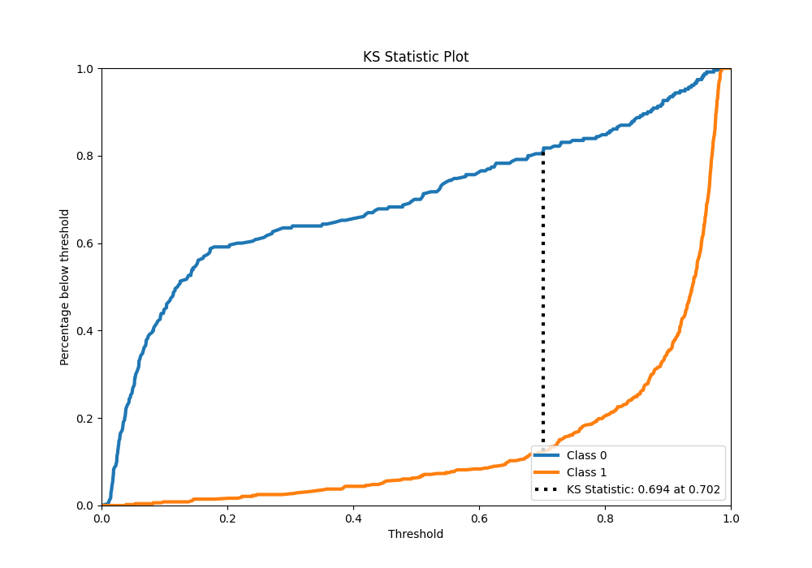
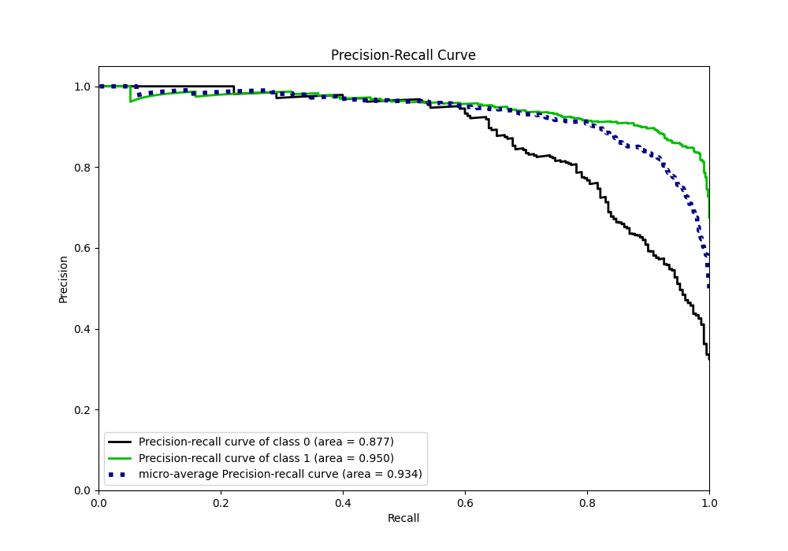
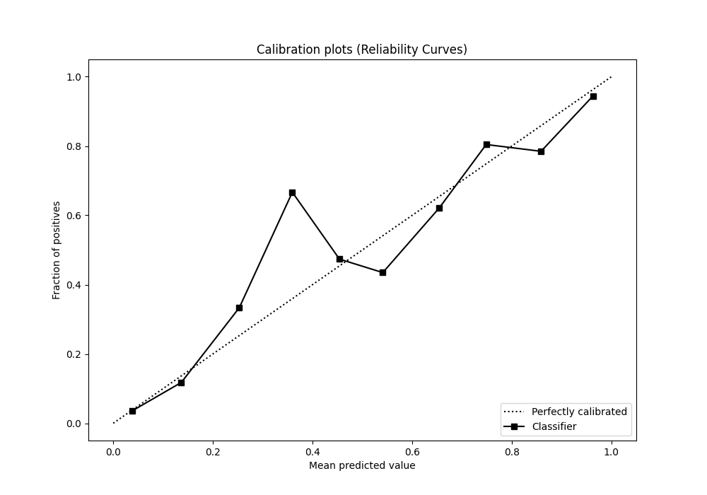
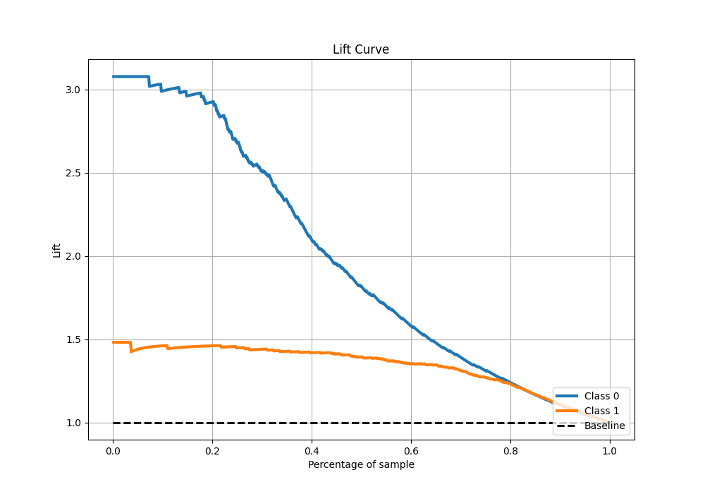

# Summary of Ensemble

[<< Go back](../README.md)

## Ensemble structure
| Model              |   Weight |
|:-------------------|---------:|
| 3_Linear           |        3 |
| 4_Default_LightGBM |        3 |
| 5_Default_Xgboost  |        3 |

## Metric details
|           |    score |    threshold |
|:----------|---------:|-------------:|
| logloss   | 0.325176 | nan          |
| auc       | 0.917228 | nan          |
| f1        | 0.906615 |   0.292645   |
| accuracy  | 0.867232 |   0.639354   |
| precision | 1        |   0.982308   |
| recall    | 1        |   0.00970316 |
| mcc       | 0.695395 |   0.639354   |

## Metric details with threshold from accuracy metric
|           |    score |   threshold |
|:----------|---------:|------------:|
| logloss   | 0.325176 |  nan        |
| auc       | 0.917228 |  nan        |
| f1        | 0.902287 |    0.639354 |
| accuracy  | 0.867232 |    0.639354 |
| precision | 0.896694 |    0.639354 |
| recall    | 0.90795  |    0.639354 |
| mcc       | 0.695395 |    0.639354 |

## Confusion matrix (at threshold=0.639354)
|              |   Predicted as 0 |   Predicted as 1 |
|:-------------|-----------------:|-----------------:|
| Labeled as 0 |              180 |               50 |
| Labeled as 1 |               44 |              434 |

## Learning curves

## Confusion Matrix

## Normalized Confusion Matrix

## ROC Curve

## Kolmogorov-Smirnov Statistic

## Precision-Recall Curve

## Calibration Curve

## Cumulative Gains Curve

## Lift Curve

[<< Go back](../README.md)
