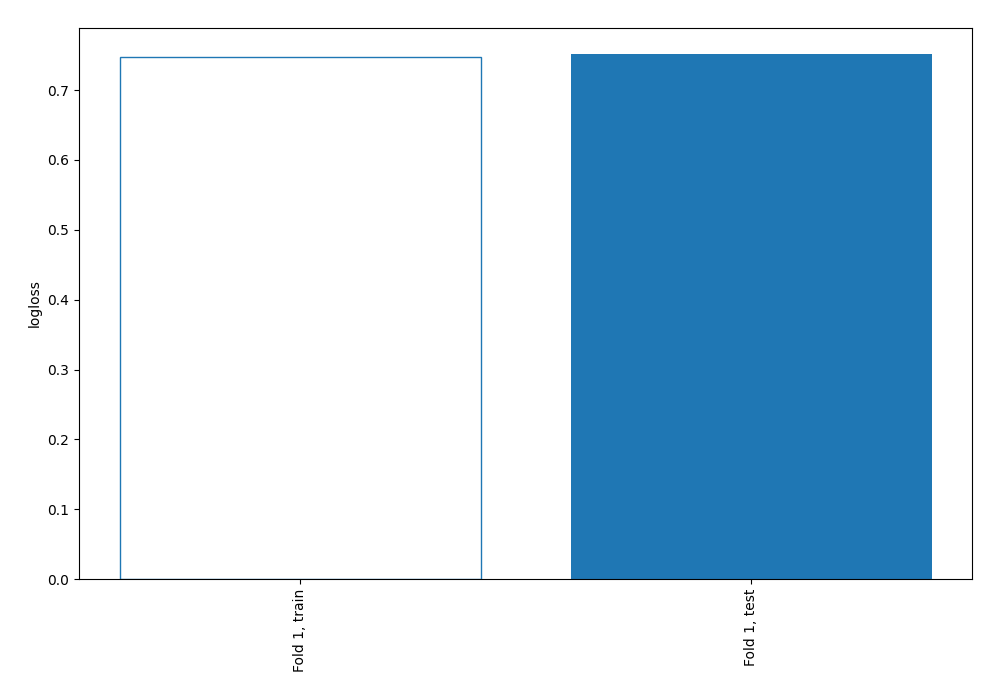
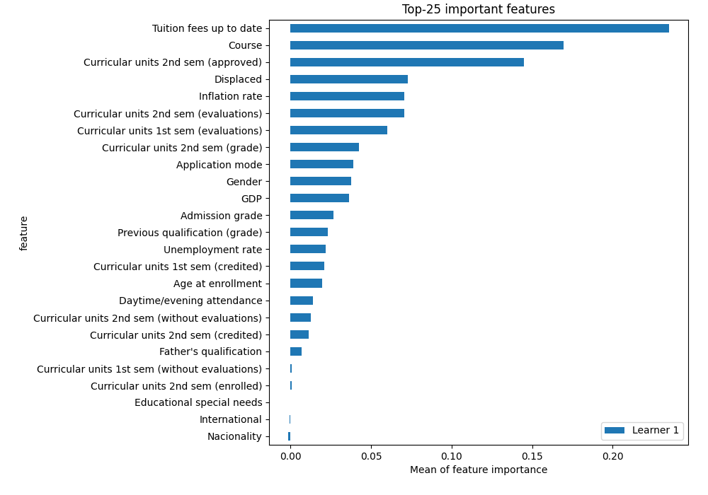
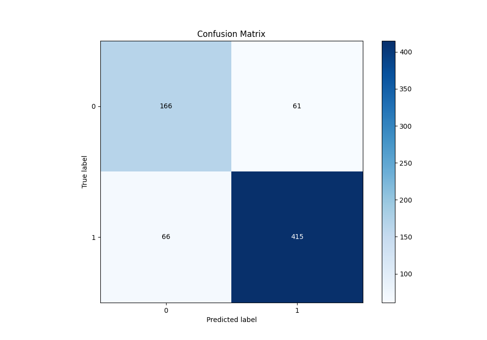
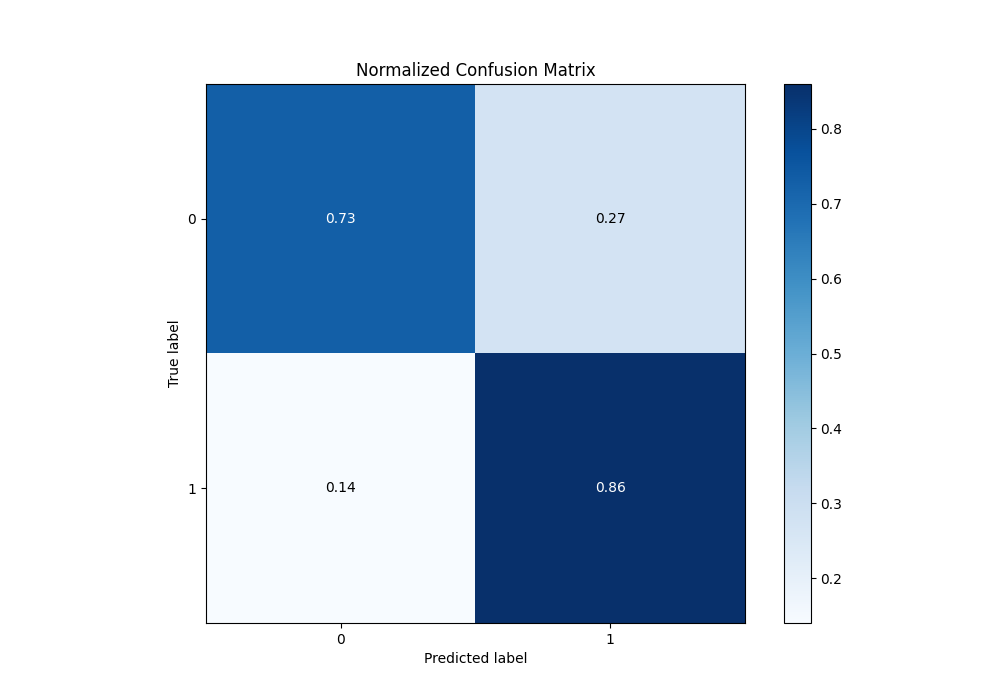
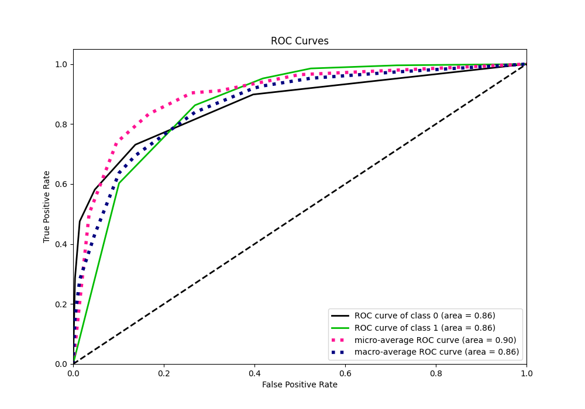
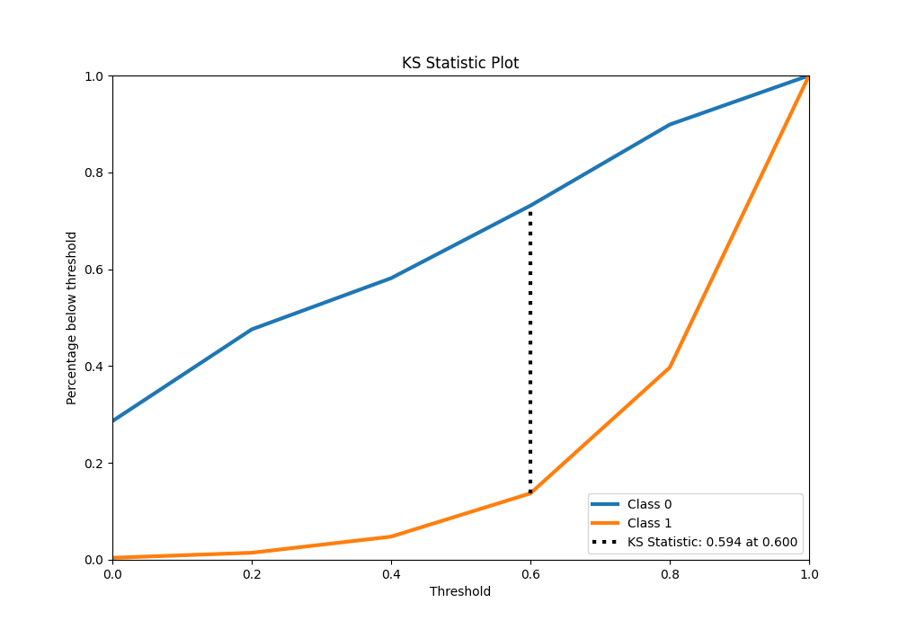
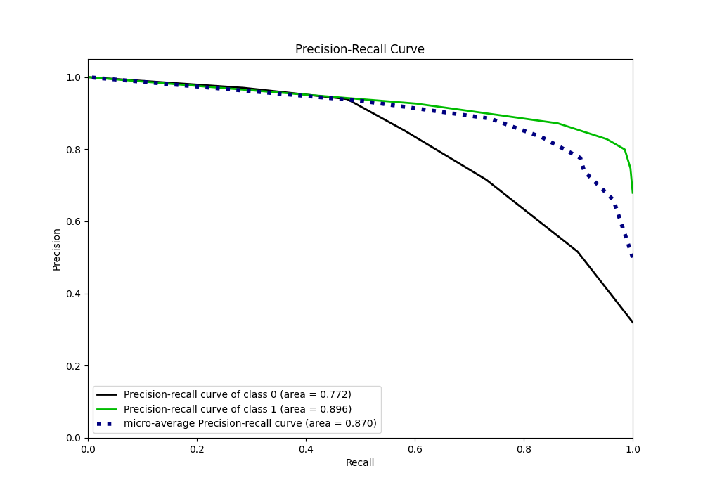
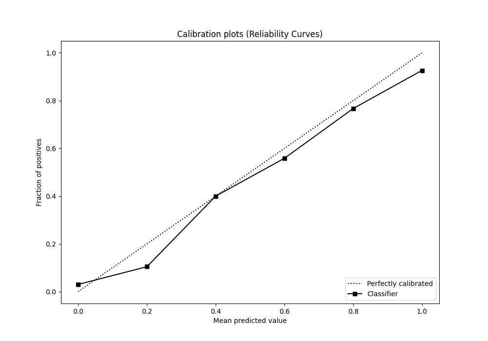
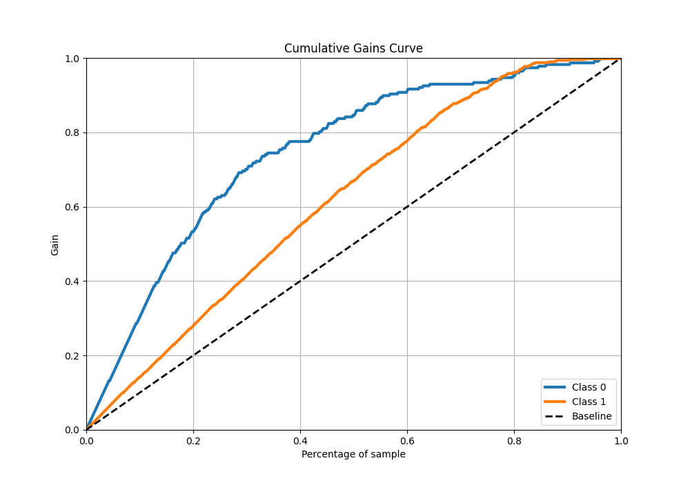
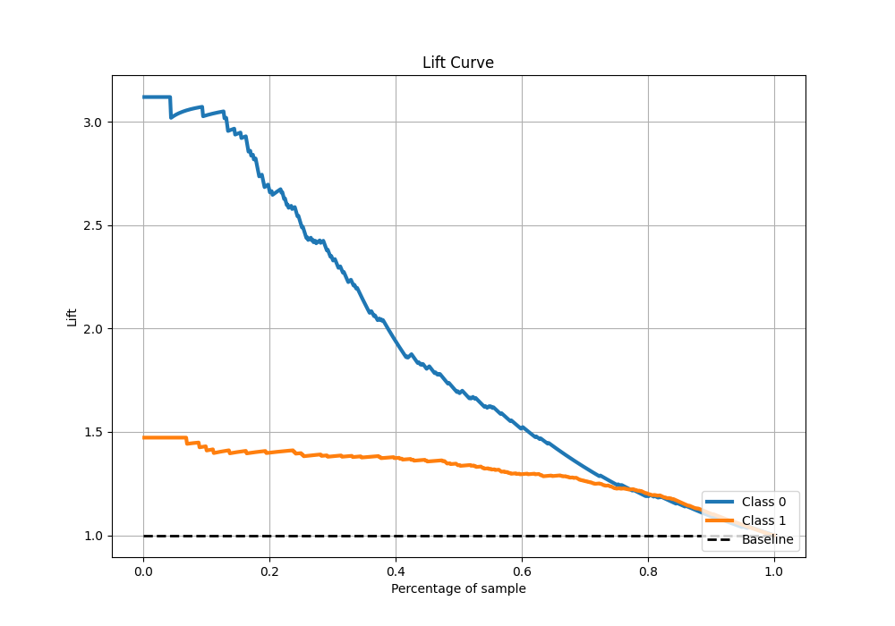

# Summary of 10_Default_NearestNeighbors

[<< Go back](../README.md)

## k-Nearest Neighbors (Nearest Neighbors)
- **n_jobs**: -1
- **n_neighbors**: 5
- **weights**: uniform
- **explain_level**: 2

## Validation
 - **validation_type**: split
 - **train_ratio**: 0.8
 - **shuffle**: True
 - **stratify**: True

## Optimized metric
logloss

## Training time

1.9 seconds

## Metric details
|           |    score |   threshold |
|:----------|---------:|------------:|
| logloss   | 0.751585 |       nan   |
| auc       | 0.864979 |       nan   |
| f1        | 0.867294 |         0.7 |
| accuracy  | 0.820621 |         0.7 |
| precision | 0.926518 |         0.8 |
| recall    | 0.995842 |         0   |
| mcc       | 0.590705 |         0.7 |

## Metric details with threshold from accuracy metric
|           |    score |   threshold |
|:----------|---------:|------------:|
| logloss   | 0.751585 |       nan   |
| auc       | 0.864979 |       nan   |
| f1        | 0.867294 |         0.7 |
| accuracy  | 0.820621 |         0.7 |
| precision | 0.871849 |         0.7 |
| recall    | 0.862786 |         0.7 |
| mcc       | 0.590705 |         0.7 |

## Confusion matrix (at threshold=0.7)
|              |   Predicted as 0 |   Predicted as 1 |
|:-------------|-----------------:|-----------------:|
| Labeled as 0 |              166 |               61 |
| Labeled as 1 |               66 |              415 |

## Learning curves

## Permutation-based Importance

## Confusion Matrix

## Normalized Confusion Matrix

## ROC Curve

## Kolmogorov-Smirnov Statistic

## Precision-Recall Curve

## Calibration Curve

## Cumulative Gains Curve

## Lift Curve

[<< Go back](../README.md)
