# Summary of 3_Linear

[<< Go back](../README.md)

## Logistic Regression (Linear)
- **n_jobs**: -1
- **explain_level**: 2

## Validation
 - **validation_type**: split
 - **train_ratio**: 0.8
 - **shuffle**: True
 - **stratify**: True

## Optimized metric
logloss

## Training time

4.1 seconds

## Metric details
|           |    score |     threshold |
|:----------|---------:|--------------:|
| logloss   | 0.315698 | nan           |
| auc       | 0.921502 | nan           |
| f1        | 0.911111 |   0.562151    |
| accuracy  | 0.875706 |   0.562151    |
| precision | 1        |   0.969464    |
| recall    | 1        |   0.000695186 |
| mcc       | 0.708211 |   0.562151    |

## Metric details with threshold from accuracy metric
|           |    score |   threshold |
|:----------|---------:|------------:|
| logloss   | 0.315698 |  nan        |
| auc       | 0.921502 |  nan        |
| f1        | 0.911111 |    0.562151 |
| accuracy  | 0.875706 |    0.562151 |
| precision | 0.886051 |    0.562151 |
| recall    | 0.93763  |    0.562151 |
| mcc       | 0.708211 |    0.562151 |

## Confusion matrix (at threshold=0.562151)
|              |   Predicted as 0 |   Predicted as 1 |
|:-------------|-----------------:|-----------------:|
| Labeled as 0 |              169 |               58 |
| Labeled as 1 |               30 |              451 |

## Learning curves
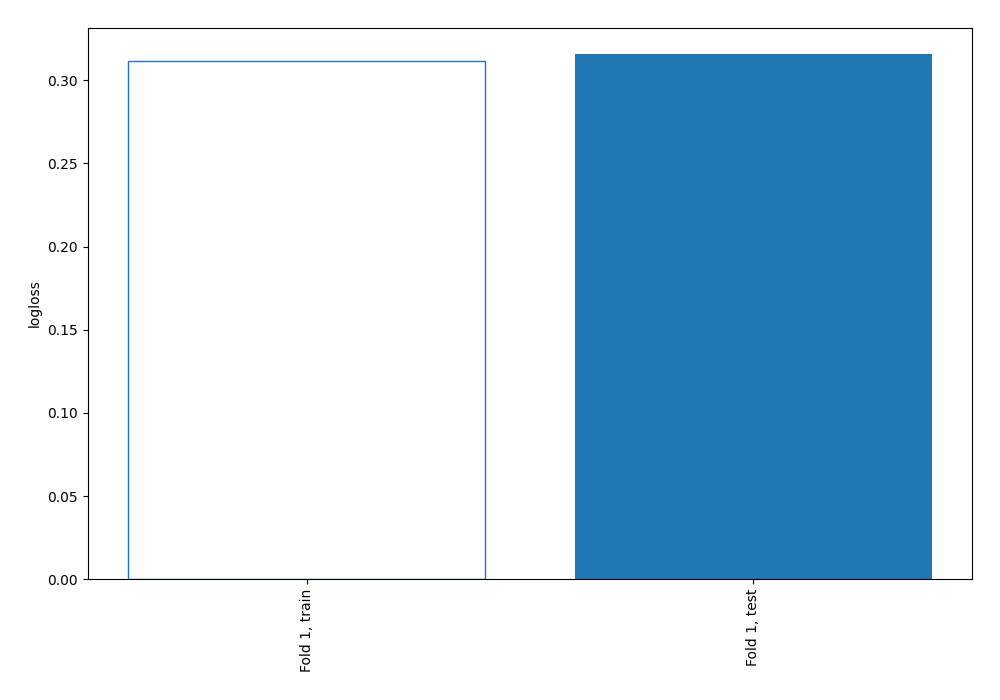

## Coefficients
| feature                                        |   Learner_1 |
|:-----------------------------------------------|------------:|
| Curricular units 2nd sem (approved)            |   1.85056   |
| International                                  |   1.1937    |
| intercept                                      |   1.07059   |
| Curricular units 1st sem (approved)            |   0.895777  |
| Tuition fees up to date                        |   0.799029  |
| Scholarship holder                             |   0.534713  |
| Mother's occupation                            |   0.398791  |
| Curricular units 2nd sem (grade)               |   0.259993  |
| Curricular units 2nd sem (evaluations)         |   0.169645  |
| Curricular units 1st sem (without evaluations) |   0.160843  |
| Father's qualification                         |   0.13758   |
| Curricular units 2nd sem (without evaluations) |   0.112499  |
| Previous qualification                         |   0.109798  |
| Marital status                                 |   0.0879191 |
| Admission grade                                |   0.0732206 |
| Curricular units 1st sem (enrolled)            |   0.0283835 |
| Application mode                               |   0.0234726 |
| Curricular units 1st sem (evaluations)         |   0.0170394 |
| GDP                                            |   0.0148413 |
| Daytime/evening attendance                     |  -0.021116  |
| Previous qualification (grade)                 |  -0.0295763 |
| Inflation rate                                 |  -0.0351065 |
| Father's occupation                            |  -0.110004  |
| Application order                              |  -0.128517  |
| Nacionality                                    |  -0.158061  |
| Unemployment rate                              |  -0.16225   |
| Mother's qualification                         |  -0.196771  |
| Displaced                                      |  -0.199568  |
| Course                                         |  -0.238658  |
| Curricular units 1st sem (grade)               |  -0.301081  |
| Educational special needs                      |  -0.345331  |
| Age at enrollment                              |  -0.398241  |
| Gender                                         |  -0.401955  |
| Curricular units 1st sem (credited)            |  -0.405959  |
| Debtor                                         |  -0.417958  |
| Curricular units 2nd sem (credited)            |  -0.4366    |
| Curricular units 2nd sem (enrolled)            |  -0.894195  |

## Permutation-based Importance
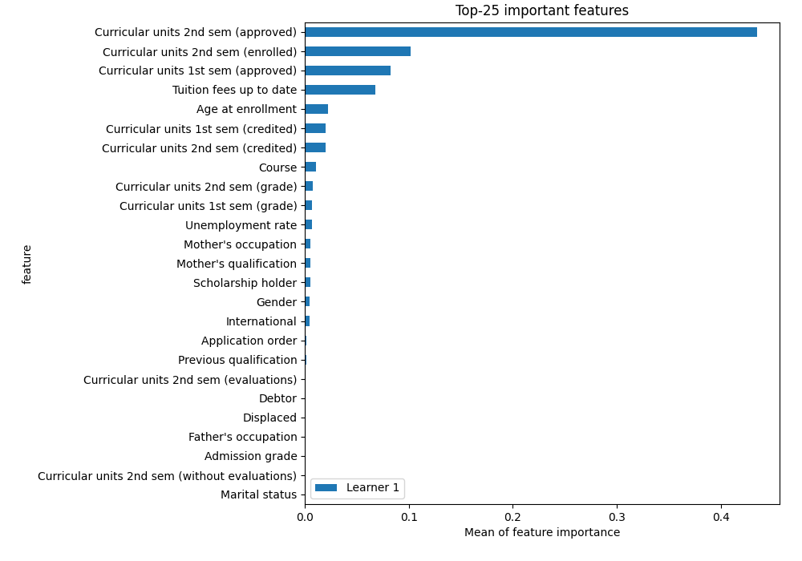
## Confusion Matrix

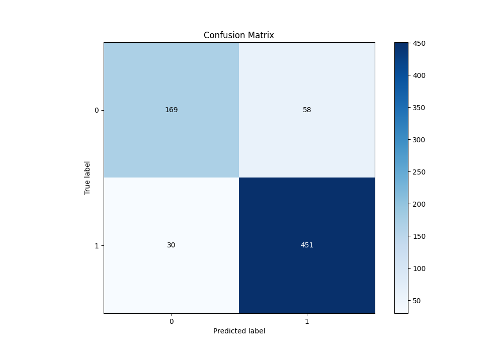

## Normalized Confusion Matrix

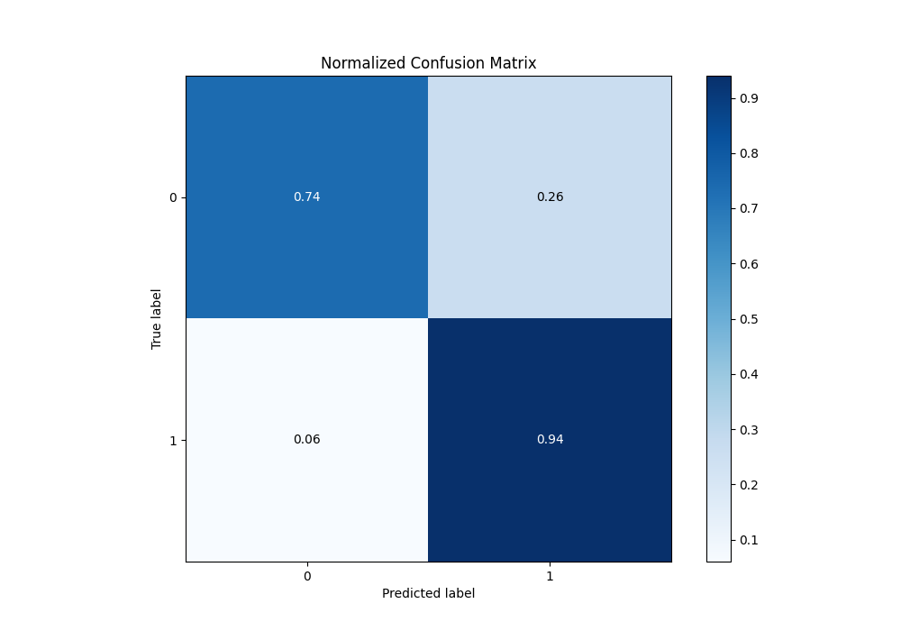

## ROC Curve

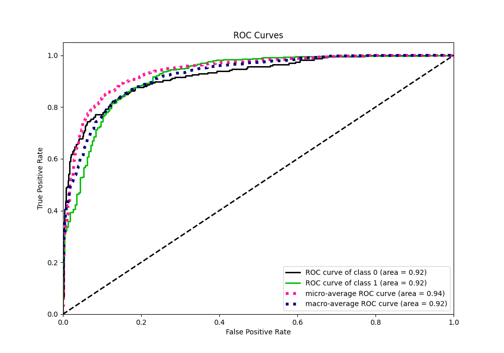

## Kolmogorov-Smirnov Statistic

## Precision-Recall Curve

## Calibration Curve

## Cumulative Gains Curve

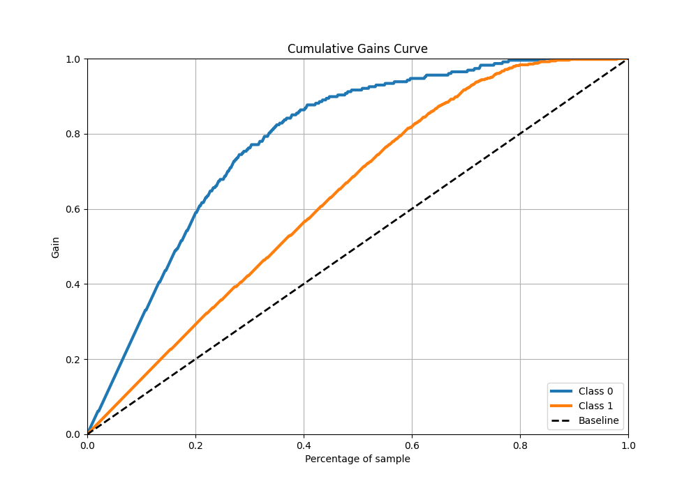

## Lift Curve

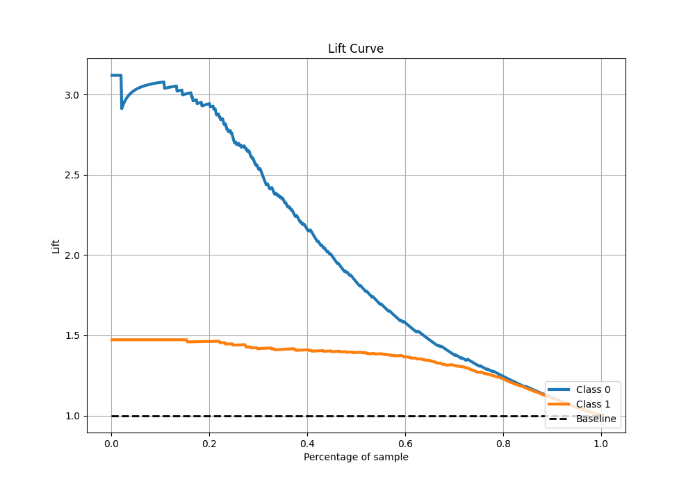

## SHAP Importance
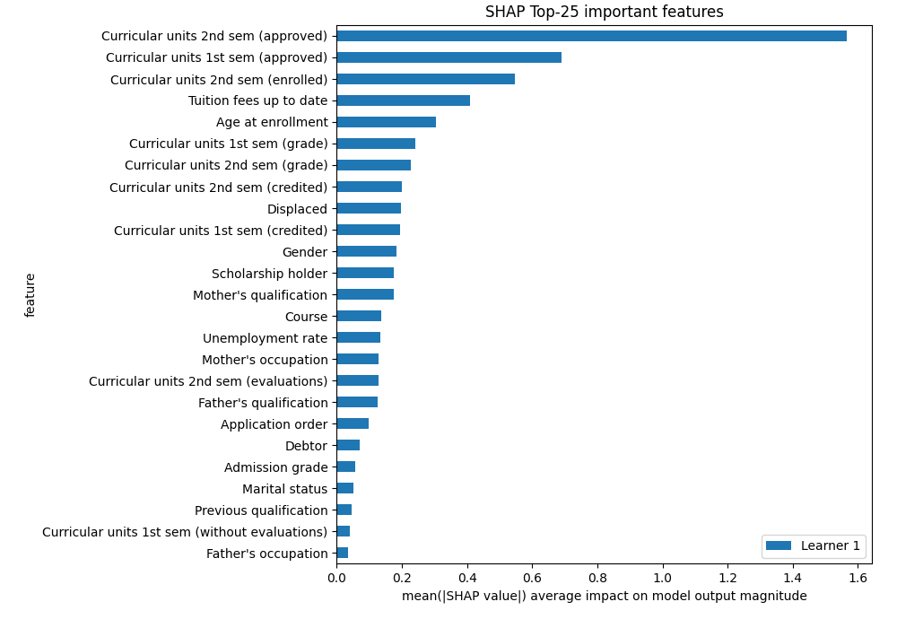

## SHAP Dependence plots

### Dependence (Fold 1)
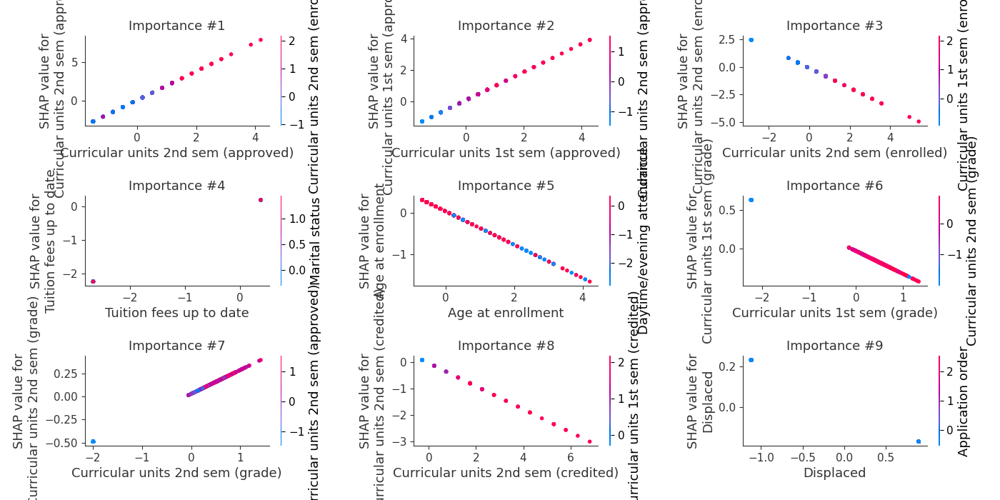

## SHAP Decision plots

### Top-10 Worst decisions for class 0 (Fold 1)
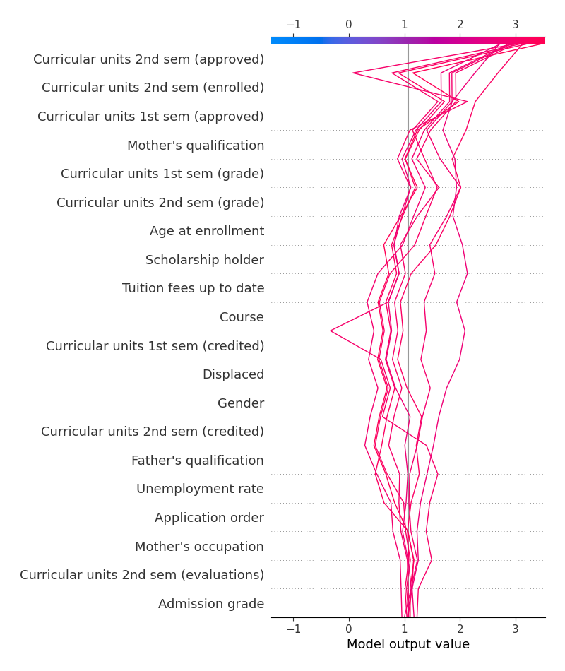
### Top-10 Best decisions for class 0 (Fold 1)
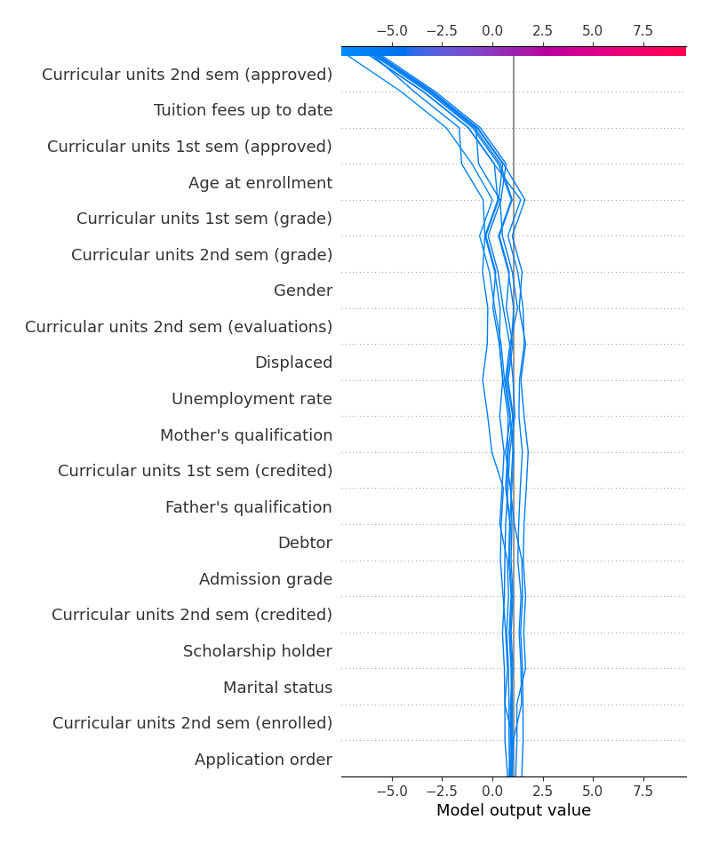
### Top-10 Worst decisions for class 1 (Fold 1)
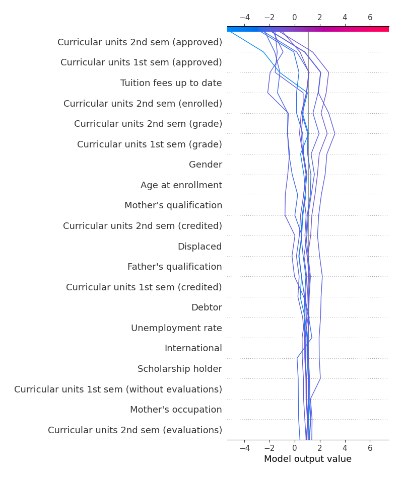
### Top-10 Best decisions for class 1 (Fold 1)

[<< Go back](../README.md)
