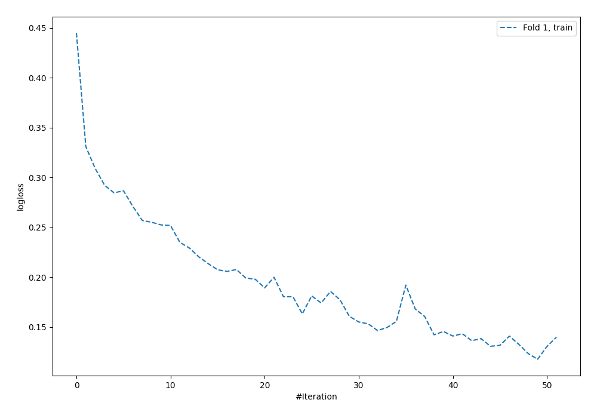
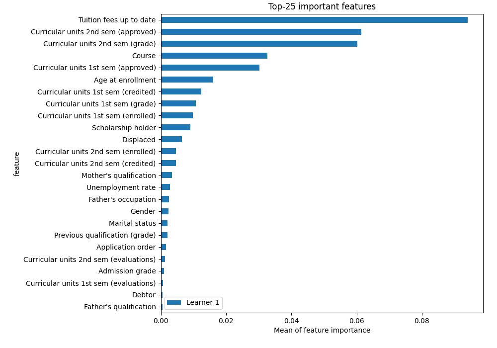
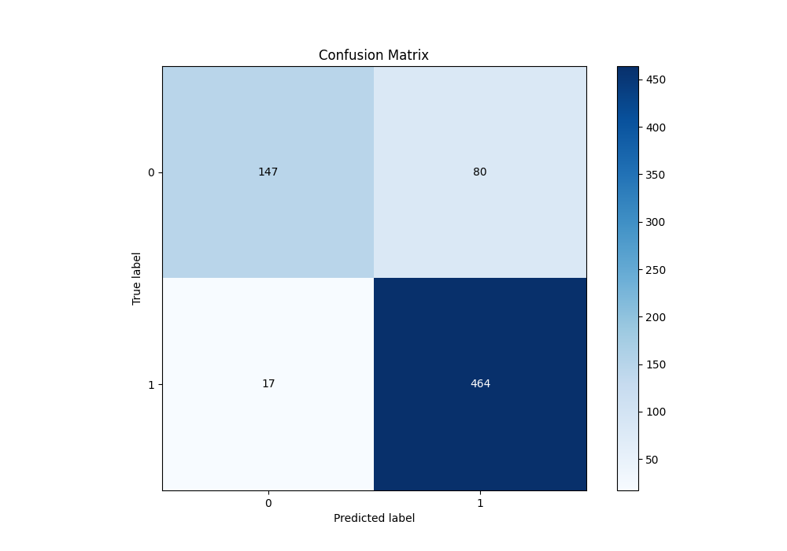
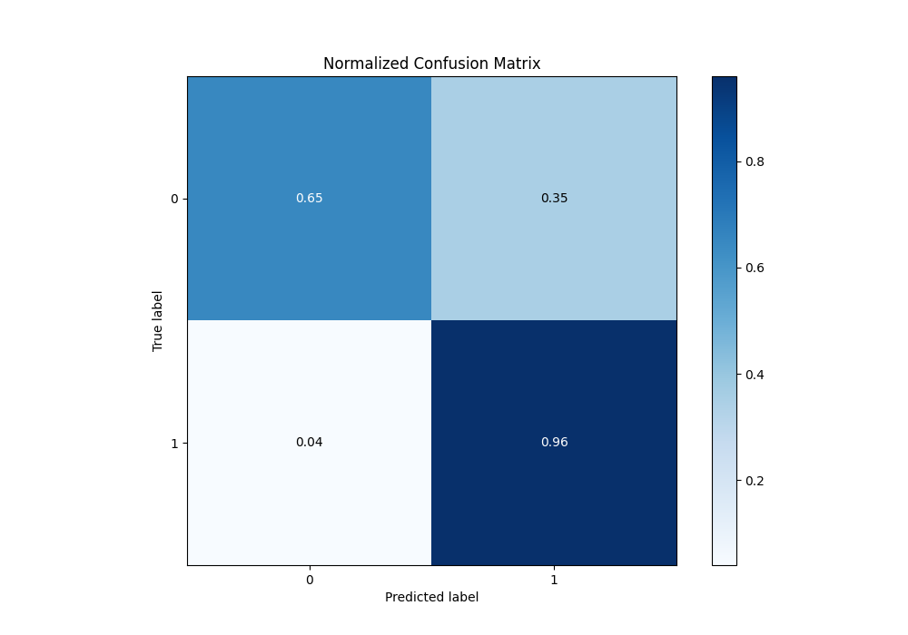
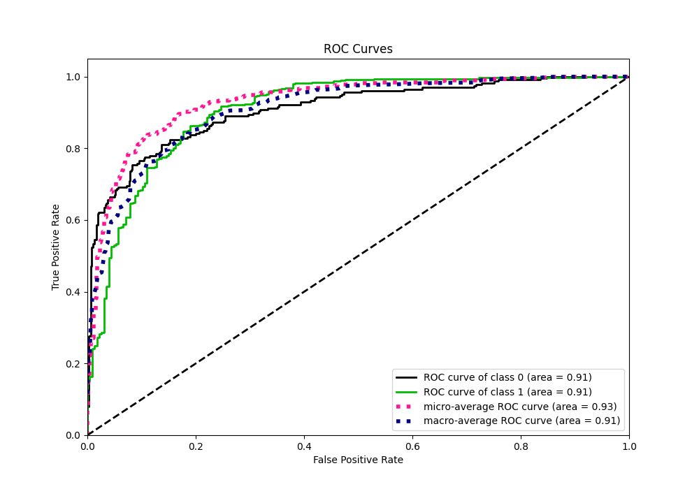
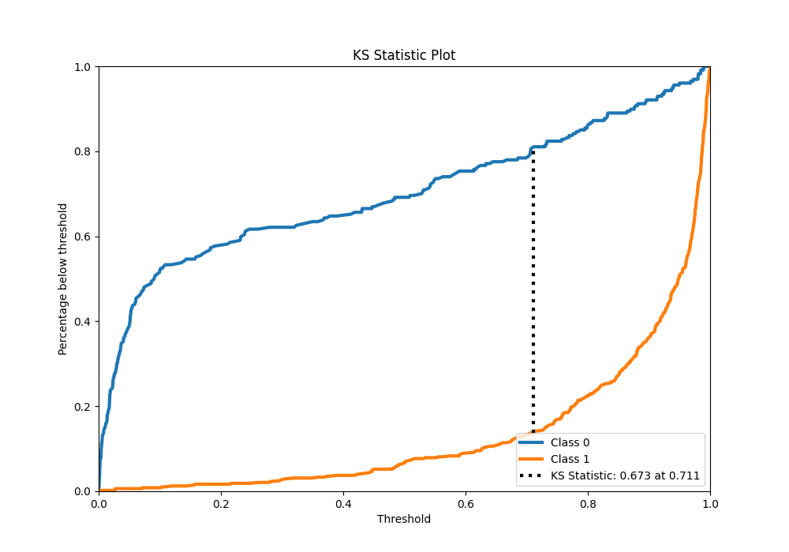
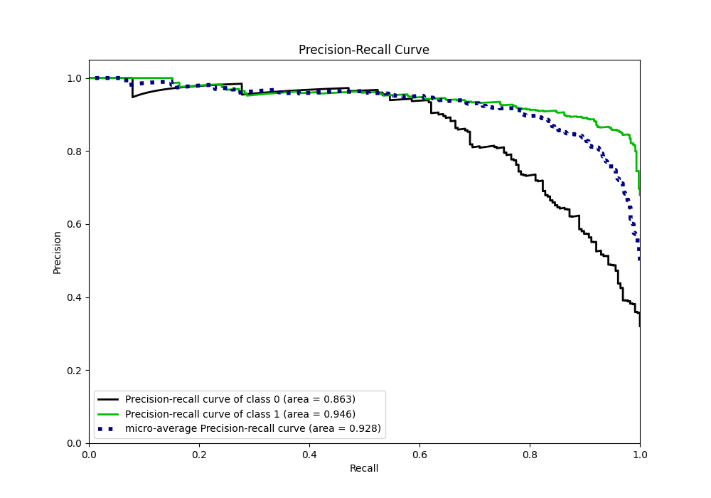
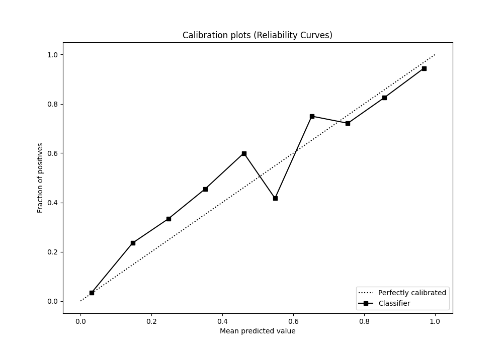
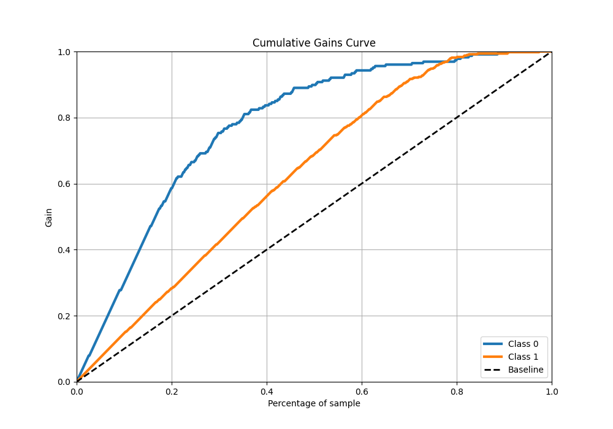
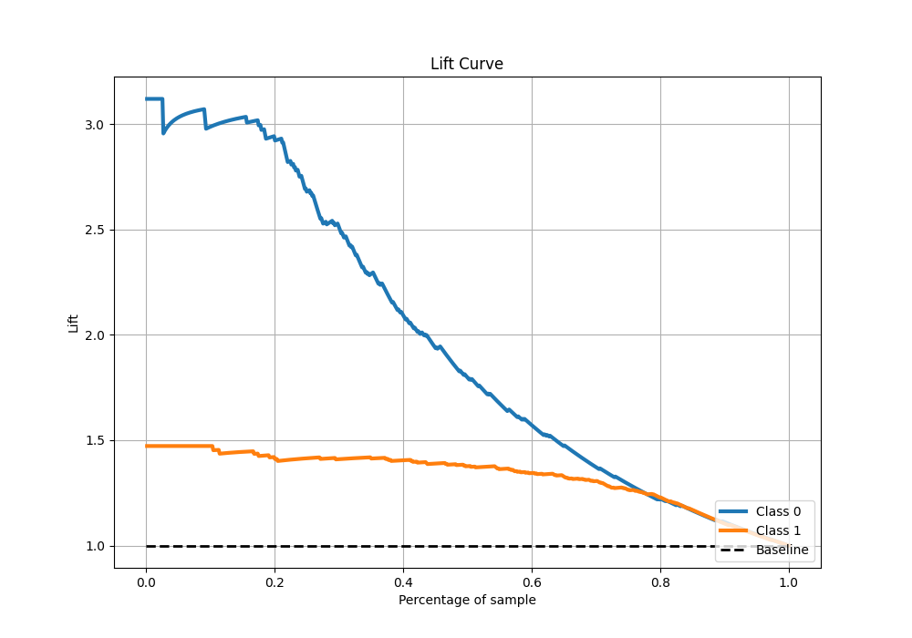

# Summary of 7_Default_NeuralNetwork

[<< Go back](../README.md)

## Neural Network
- **n_jobs**: -1
- **dense_1_size**: 32
- **dense_2_size**: 16
- **learning_rate**: 0.05
- **explain_level**: 2

## Validation
 - **validation_type**: split
 - **train_ratio**: 0.8
 - **shuffle**: True
 - **stratify**: True

## Optimized metric
logloss

## Training time

2.2 seconds

## Metric details
|           |    score |     threshold |
|:----------|---------:|--------------:|
| logloss   | 0.338848 | nan           |
| auc       | 0.908808 | nan           |
| f1        | 0.906641 |   0.279195    |
| accuracy  | 0.862994 |   0.381433    |
| precision | 1        |   0.990914    |
| recall    | 1        |   0.000350146 |
| mcc       | 0.680664 |   0.279195    |

## Metric details with threshold from accuracy metric
|           |    score |   threshold |
|:----------|---------:|------------:|
| logloss   | 0.338848 |  nan        |
| auc       | 0.908808 |  nan        |
| f1        | 0.905366 |    0.381433 |
| accuracy  | 0.862994 |    0.381433 |
| precision | 0.852941 |    0.381433 |
| recall    | 0.964657 |    0.381433 |
| mcc       | 0.677301 |    0.381433 |

## Confusion matrix (at threshold=0.381433)
|              |   Predicted as 0 |   Predicted as 1 |
|:-------------|-----------------:|-----------------:|
| Labeled as 0 |              147 |               80 |
| Labeled as 1 |               17 |              464 |

## Learning curves

## Permutation-based Importance

## Confusion Matrix

## Normalized Confusion Matrix

## ROC Curve

## Kolmogorov-Smirnov Statistic

## Precision-Recall Curve

## Calibration Curve

## Cumulative Gains Curve

## Lift Curve

[<< Go back](../README.md)
