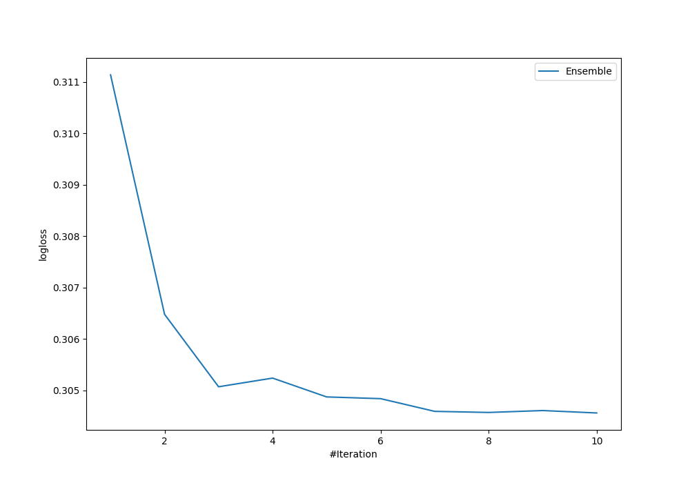
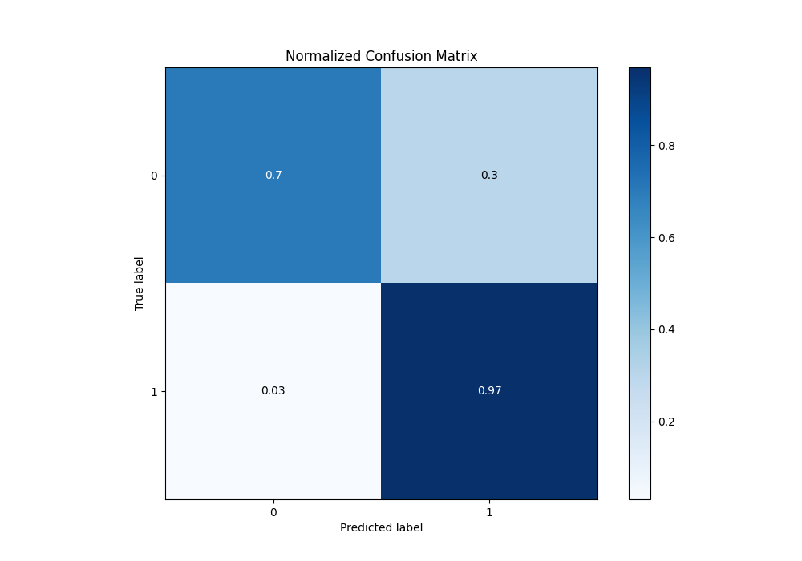
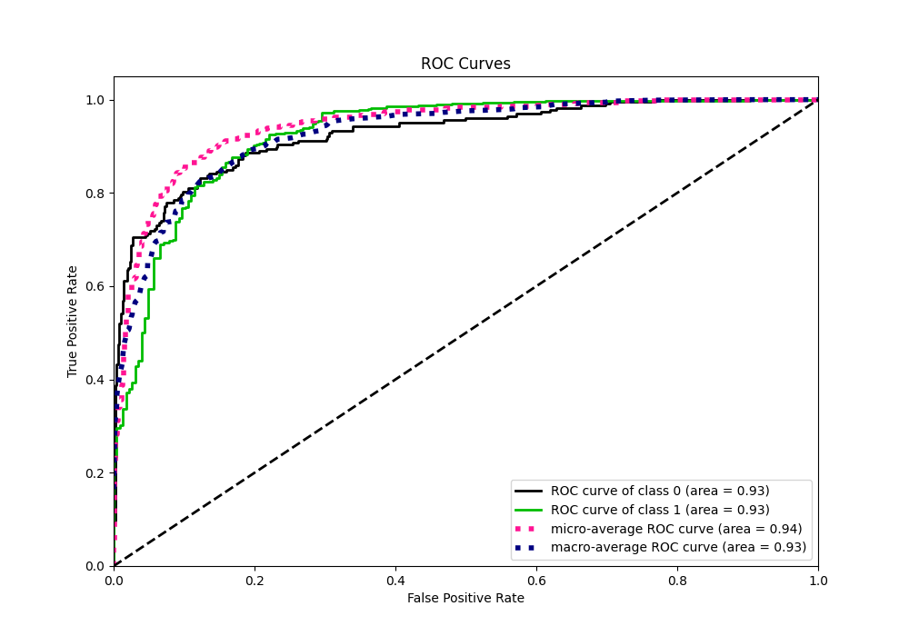
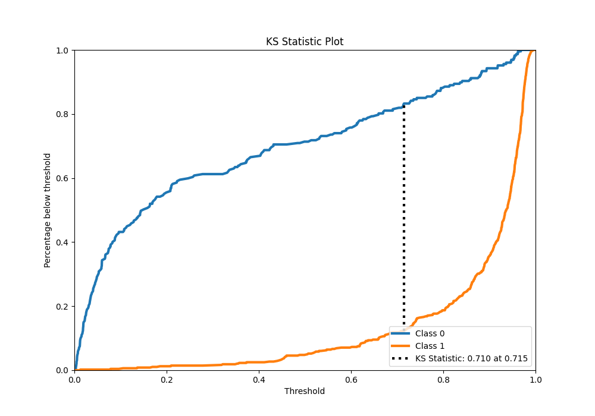
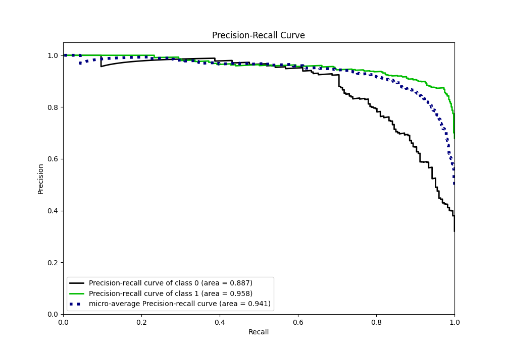
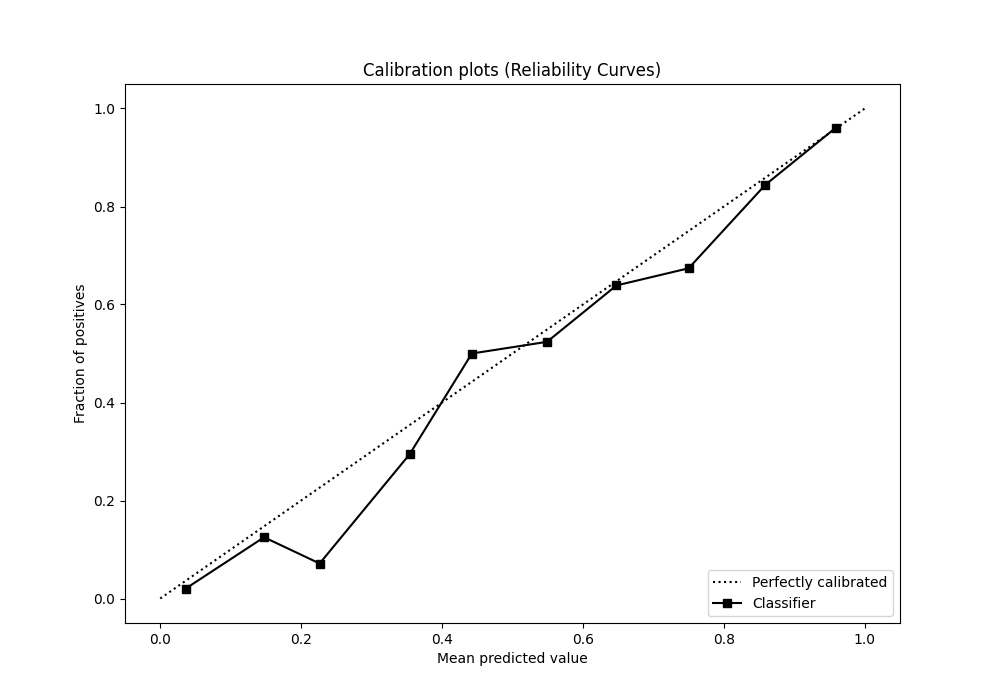
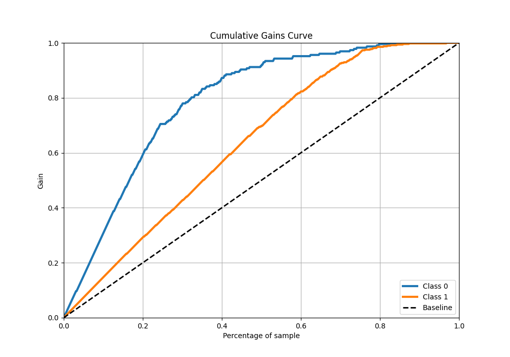
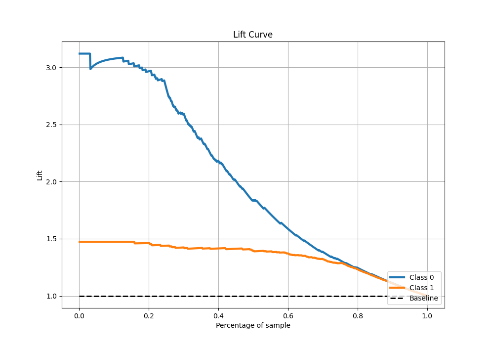

# Summary of Ensemble

[<< Go back](../README.md)

## Ensemble structure
| Model                   |   Weight |
|:------------------------|---------:|
| 3_Linear                |        3 |
| 5_Default_Xgboost       |        3 |
| 6_Default_CatBoost      |        3 |
| 7_Default_NeuralNetwork |        1 |

## Metric details
|           |    score |   threshold |
|:----------|---------:|------------:|
| logloss   | 0.304563 | nan         |
| auc       | 0.926548 | nan         |
| f1        | 0.920197 |   0.443991  |
| accuracy  | 0.885593 |   0.443991  |
| precision | 1        |   0.980974  |
| recall    | 1        |   0.0028156 |
| mcc       | 0.73252  |   0.443991  |

## Metric details with threshold from accuracy metric
|           |    score |   threshold |
|:----------|---------:|------------:|
| logloss   | 0.304563 |  nan        |
| auc       | 0.926548 |  nan        |
| f1        | 0.920197 |    0.443991 |
| accuracy  | 0.885593 |    0.443991 |
| precision | 0.874532 |    0.443991 |
| recall    | 0.970894 |    0.443991 |
| mcc       | 0.73252  |    0.443991 |

## Confusion matrix (at threshold=0.443991)
|              |   Predicted as 0 |   Predicted as 1 |
|:-------------|-----------------:|-----------------:|
| Labeled as 0 |              160 |               67 |
| Labeled as 1 |               14 |              467 |

## Learning curves

## Confusion Matrix

## Normalized Confusion Matrix

## ROC Curve

## Kolmogorov-Smirnov Statistic

## Precision-Recall Curve

## Calibration Curve

## Cumulative Gains Curve

## Lift Curve

[<< Go back](../README.md)
