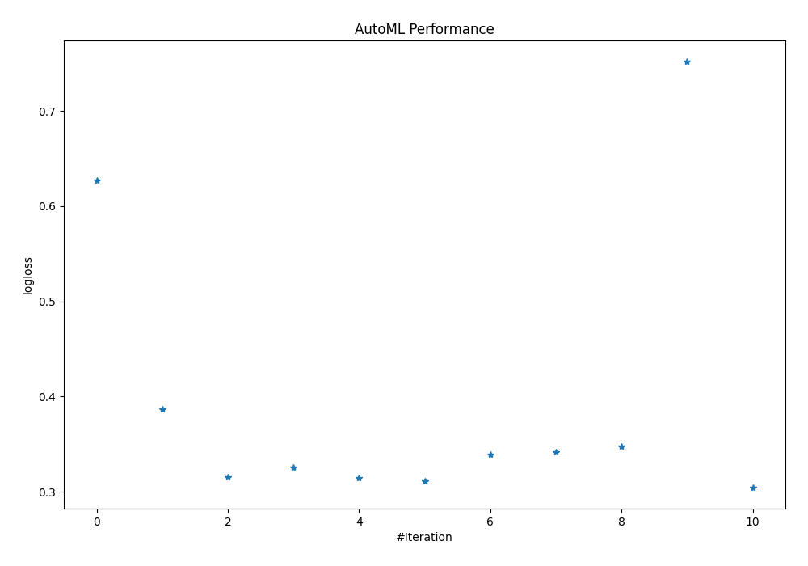
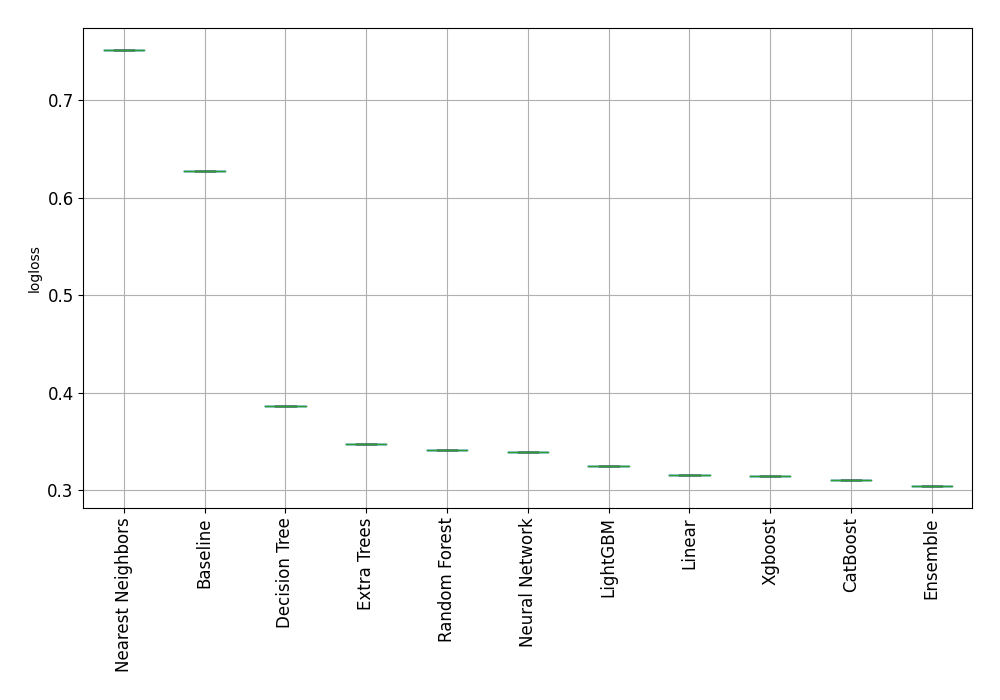
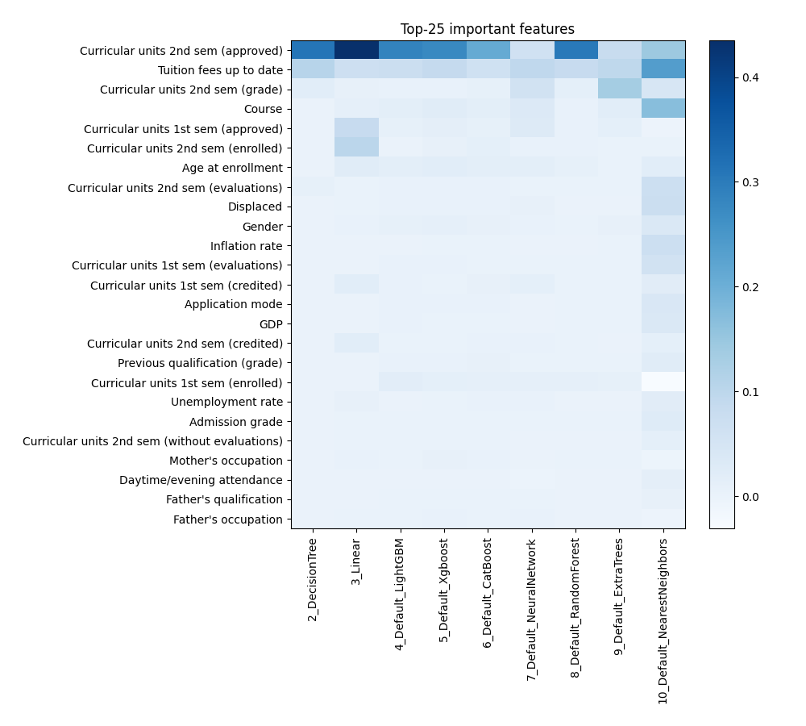
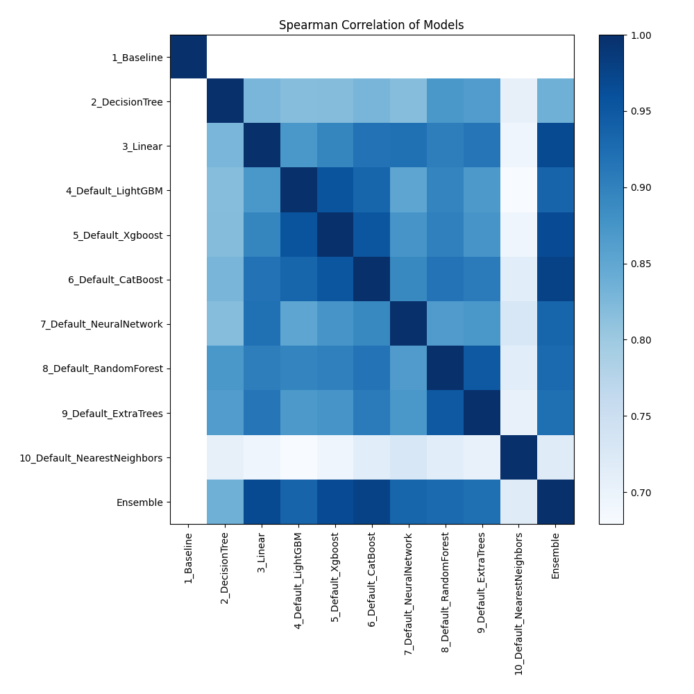

# AutoML Leaderboard

| Best model   | name                                                                 | model_type        | metric_type   |   metric_value |   train_time |
|:-------------|:---------------------------------------------------------------------|:------------------|:--------------|---------------:|-------------:|
|              | [1_Baseline](1_Baseline/README.md)                                   | Baseline          | logloss       |       0.627337 |         1.62 |
|              | [2_DecisionTree](2_DecisionTree/README.md)                           | Decision Tree     | logloss       |       0.386407 |         8.68 |
|              | [3_Linear](3_Linear/README.md)                                       | Linear            | logloss       |       0.315698 |         5.11 |
|              | [4_Default_LightGBM](4_Default_LightGBM/README.md)                   | LightGBM          | logloss       |       0.32518  |         5.9  |
|              | [5_Default_Xgboost](5_Default_Xgboost/README.md)                     | Xgboost           | logloss       |       0.314607 |         5.81 |
|              | [6_Default_CatBoost](6_Default_CatBoost/README.md)                   | CatBoost          | logloss       |       0.311137 |         3.3  |
|              | [7_Default_NeuralNetwork](7_Default_NeuralNetwork/README.md)         | Neural Network    | logloss       |       0.338848 |         2.98 |
|              | [8_Default_RandomForest](8_Default_RandomForest/README.md)           | Random Forest     | logloss       |       0.341809 |         6.03 |
|              | [9_Default_ExtraTrees](9_Default_ExtraTrees/README.md)               | Extra Trees       | logloss       |       0.347271 |         5.76 |
|              | [10_Default_NearestNeighbors](10_Default_NearestNeighbors/README.md) | Nearest Neighbors | logloss       |       0.751585 |         2.71 |
| **the best** | [Ensemble](Ensemble/README.md)                                       | Ensemble          | logloss       |       0.304563 |         2.04 |

### AutoML Performance

### AutoML Performance Boxplot

### Features Importance

### Spearman Correlation of Models

